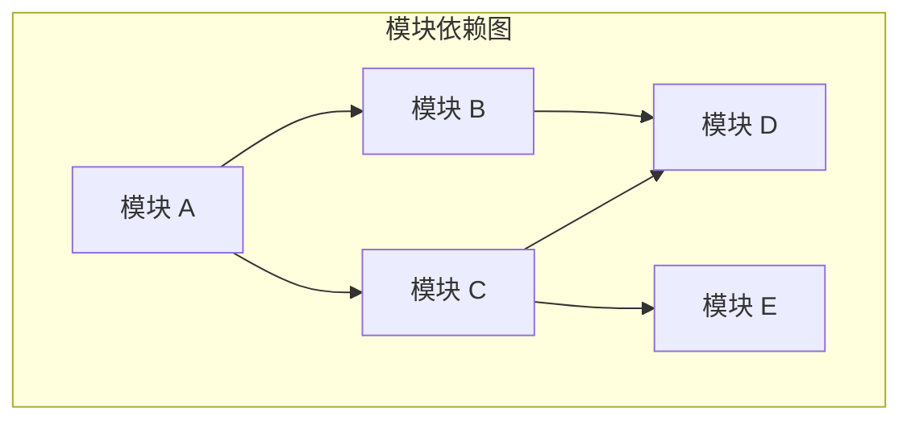
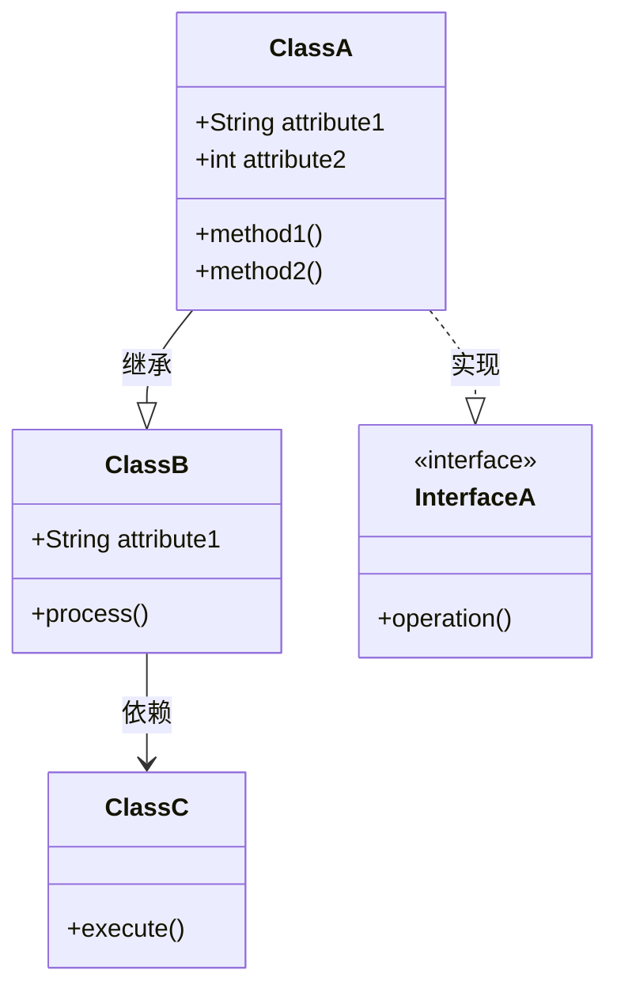
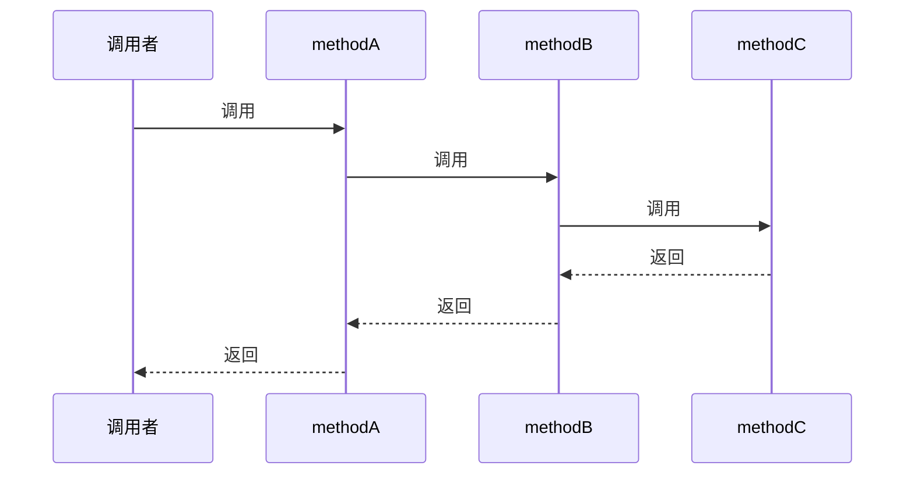
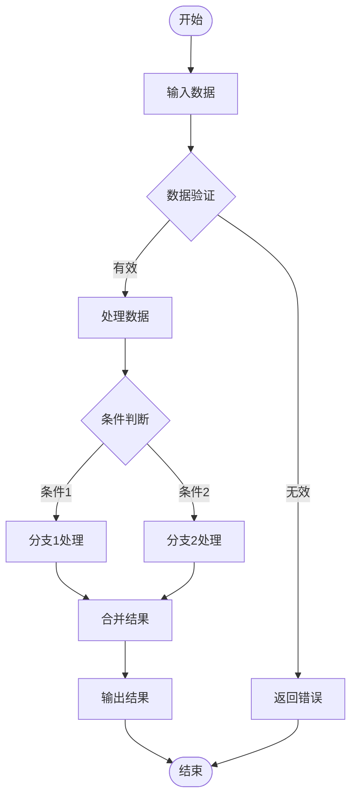
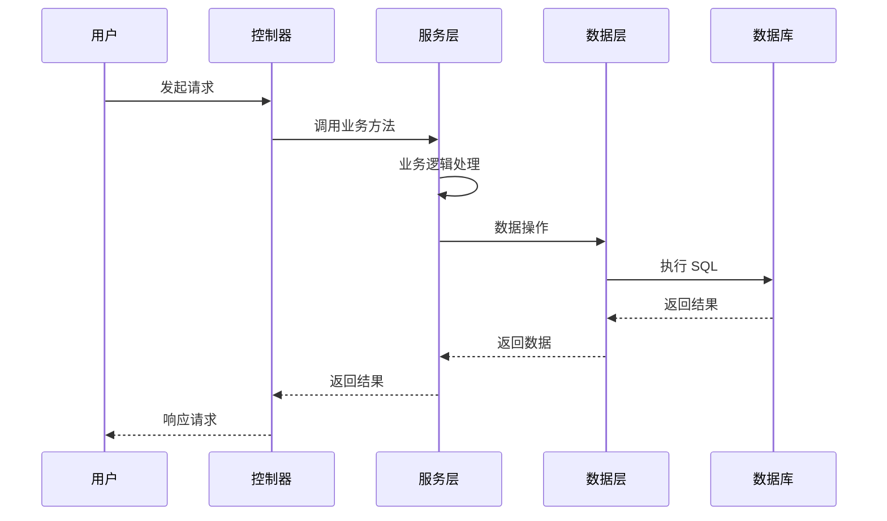
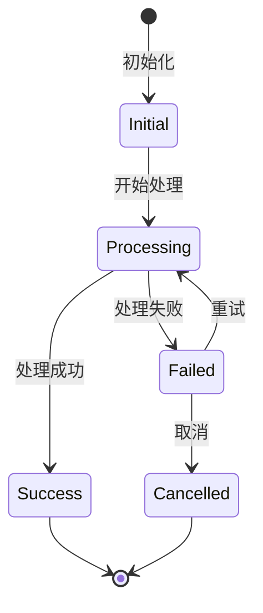
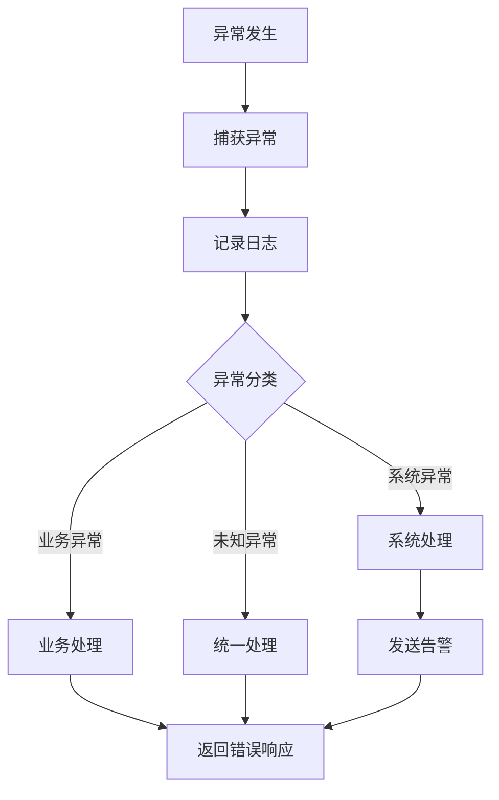
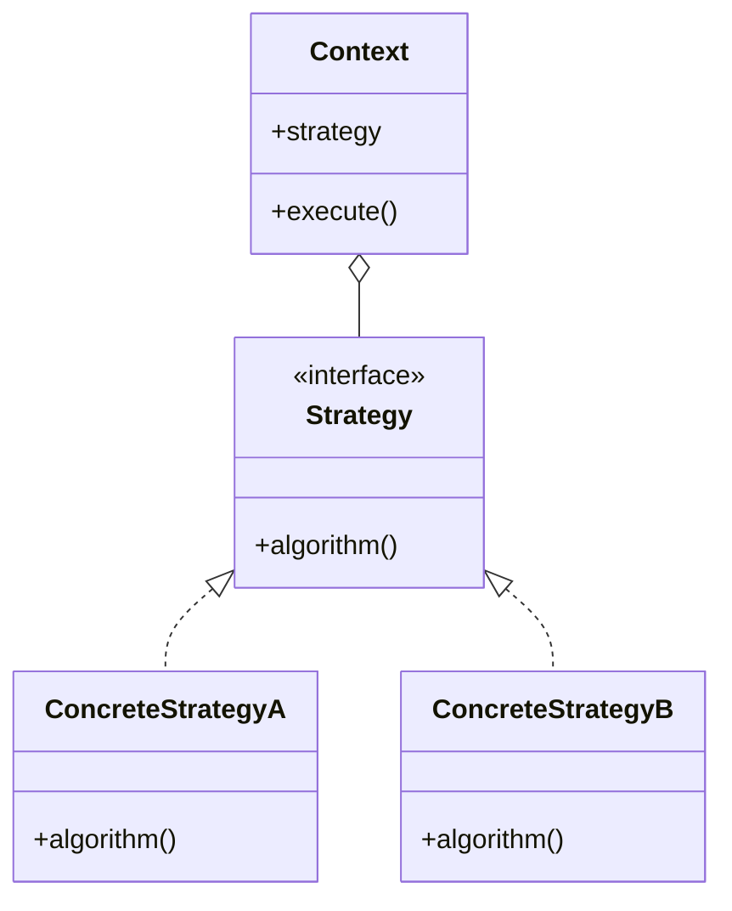

# S6-A01 输出模板：模块详细设计文档

## 模板说明

本模板用于 S6-A01（模块详细设计）的输出产物：**模块详细设计文档**。

**产物 ID 格式**：`{PlanID}-S6-A01-001`

**存储路径**：`artifacts/stages/s6/{PlanID}-S6-A01-001.md`

**模板版本**：1.0

---

## 模板内容

```markdown
# 模块详细设计文档

## 元信息

| 项目 | 内容 |
|-----|------|
| **文档 ID** | {PlanID}-S6-A01-001 |
| **Plan ID** | {PlanID} |
| **Skill 编号** | S6-A01 |
| **Skill 名称** | 模块详细设计 |
| **生成时间** | {YYYY-MM-DD HH:MM} |
| **版本** | v1.0 |
| **设计模块数** | {N} 个 |
| **设计类数** | {N} 个 |

---

## 一、模块设计概览

### 1.1 执行摘要

**设计目标**：
- 将架构设计转化为可实现的模块设计
- 明确模块职责、接口和交互关系
- 为编码实现提供详细指导

**设计范围**：
- 模块数量：{N} 个
- 核心类数量：{N} 个
- 接口数量：{N} 个
- 覆盖功能点：{N} 个

### 1.2 质量评估

| 质量维度 | 得分 | 权重 | 加权得分 | 评估说明 |
|---------|------|------|---------|---------|
| 完整性 | {XX}% | 25% | {XX} | {说明} |
| 准确性 | {XX}% | 25% | {XX} | {说明} |
| 一致性 | {XX}% | 20% | {XX} | {说明} |
| 可追溯性 | {XX}% | 15% | {XX} | {说明} |
| 可实施性 | {XX}% | 15% | {XX} | {说明} |
| **综合得分** | - | 100% | **{XX}%** | {等级评定} |

**质量等级**：{优秀/良好/合格/不合格}

---

## 二、模块概述

### 2.1 模块清单

| 模块 ID | 模块名称 | 模块类型 | 职责描述 | 依赖模块 | 被依赖模块 | 复杂度 |
|--------|---------|---------|---------|---------|-----------|--------|
| M001 | {名称} | {业务/技术/通用} | {职责} | {依赖} | {被依赖} | {高/中/低} |
| M002 | {名称} | {类型} | {职责} | {依赖} | {被依赖} | {高/中/低} |
| M003 | {名称} | {类型} | {职责} | {依赖} | {被依赖} | {高/中/低} |

### 2.2 模块依赖关系



### 2.3 模块分层结构

| 层级 | 模块列表 | 职责说明 |
|-----|---------|---------|
| 接口层 | {模块列表} | {职责} |
| 业务层 | {模块列表} | {职责} |
| 领域层 | {模块列表} | {职责} |
| 基础设施层 | {模块列表} | {职责} |

---

## 三、类设计

### 3.1 类清单

| 类 ID | 类名 | 所属模块 | 类类型 | 职责 | 复杂度 |
|------|-----|---------|-------|------|--------|
| C001 | {类名} | {模块} | {实体/服务/控制器/其他} | {职责} | {高/中/低} |
| C002 | {类名} | {模块} | {类型} | {职责} | {高/中/低} |
| C003 | {类名} | {模块} | {类型} | {职责} | {高/中/低} |

### 3.2 类关系图



### 3.3 核心类设计

#### 类：{ClassName}

**基本信息**：
- 类名：{ClassName}
- 所属模块：{模块名}
- 类类型：{实体类/服务类/控制器类/工具类/其他}
- 设计模式：{使用的模式}

**职责**：
{类的单一职责描述}

**属性定义**：

| 属性名 | 类型 | 可见性 | 默认值 | 说明 |
|-------|------|--------|--------|------|
| {属性 1} | {类型} | {public/private/protected} | {默认值} | {说明} |
| {属性 2} | {类型} | {可见性} | {默认值} | {说明} |

**方法定义**：

| 方法名 | 返回类型 | 参数 | 可见性 | 说明 |
|-------|---------|------|--------|------|
| {方法 1} | {返回类型} | {参数} | {可见性} | {说明} |
| {方法 2} | {返回类型} | {参数} | {可见性} | {说明} |

**依赖关系**：
- 继承：{父类}
- 实现：{接口列表}
- 依赖：{依赖类列表}
- 关联：{关联类列表}

**约束条件**：
- {约束 1}
- {约束 2}

---

#### 类：{ClassName}

**基本信息**：
- 类名：{ClassName}
- 所属模块：{模块名}
- 类类型：{类型}

**职责**：
{职责描述}

**属性定义**：

| 属性名 | 类型 | 可见性 | 默认值 | 说明 |
|-------|------|--------|--------|------|
| {属性} | {类型} | {可见性} | {默认值} | {说明} |

**方法定义**：

| 方法名 | 返回类型 | 参数 | 可见性 | 说明 |
|-------|---------|------|--------|------|
| {方法} | {返回类型} | {参数} | {可见性} | {说明} |

---

### 3.4 接口设计

| 接口名 | 所属模块 | 方法数量 | 实现类 | 使用场景 |
|-------|---------|---------|--------|---------|
| {接口 A} | {模块} | {N} | {实现类} | {场景} |
| {接口 B} | {模块} | {N} | {实现类} | {场景} |

---

## 四、方法设计

### 4.1 方法清单

| 方法 ID | 方法名 | 所属类 | 方法类型 | 复杂度 | 调用频率 |
|--------|-------|-------|---------|--------|---------|
| F001 | {方法名} | {类名} | {公开/私有/保护} | {高/中/低} | {高/中/低} |
| F002 | {方法名} | {类名} | {类型} | {高/中/低} | {高/中/低} |

### 4.2 核心方法设计

#### 方法：{methodName}

**基本信息**：
- 方法名：{methodName}
- 所属类：{ClassName}
- 可见性：{public/private/protected}
- 返回类型：{返回类型}
- 异常：{可能抛出的异常}

**方法签名**：
```
{返回类型} {methodName}({参数列表}) throws {异常列表}
```

**职责**：
{方法的单一职责描述}

**参数说明**：

| 参数名 | 类型 | 是否必填 | 说明 | 约束 |
|-------|------|---------|------|------|
| {参数 1} | {类型} | {是/否} | {说明} | {约束} |
| {参数 2} | {类型} | {是/否} | {说明} | {约束} |

**返回值说明**：

| 场景 | 返回值 | 说明 |
|-----|-------|------|
| 成功 | {值} | {说明} |
| 失败 | {值} | {说明} |
| 异常 | {值} | {说明} |

**前置条件**：
- {条件 1}
- {条件 2}

**后置条件**：
- {条件 1}
- {条件 2}

**算法/逻辑**：
```
1. {步骤 1}
2. {步骤 2}
3. {步骤 3}
```

**异常处理**：

| 异常类型 | 触发条件 | 处理方式 |
|---------|---------|---------|
| {异常 1} | {条件} | {处理} |
| {异常 2} | {条件} | {处理} |

**调用关系**：
- 调用者：{调用者列表}
- 被调用：{被调用方法列表}

**性能考虑**：
- 时间复杂度：{复杂度}
- 空间复杂度：{复杂度}
- 优化建议：{建议}

---

### 4.3 方法调用链



---

## 五、算法设计

### 5.1 算法清单

| 算法 ID | 算法名称 | 应用场景 | 时间复杂度 | 空间复杂度 | 优先级 |
|--------|---------|---------|-----------|-----------|--------|
| A001 | {名称} | {场景} | {复杂度} | {复杂度} | {P0/P1/P2} |
| A002 | {名称} | {场景} | {复杂度} | {复杂度} | {P0/P1/P2} |

### 5.2 核心算法设计

#### 算法：{algorithmName}

**基本信息**：
- 算法名：{algorithmName}
- 应用场景：{场景}
- 输入规模：{规模}
- 性能要求：{要求}

**算法描述**：
{算法的文字描述}

**算法流程**：



**伪代码**：
```
算法 {algorithmName}(输入参数)
    1. 初始化变量
    2. 验证输入数据
       如果 数据无效 则
          抛出异常
       结束如果
    3. 核心处理逻辑
       对于每个元素 执行
          处理元素
       结束对于
    4. 返回结果
结束算法
```

**复杂度分析**：

| 复杂度类型 | 复杂度 | 说明 |
|-----------|--------|------|
| 时间复杂度 | {O(n)/O(log n)/O(n^2)等} | {说明} |
| 空间复杂度 | {O(1)/O(n)/O(n^2)等} | {说明} |
| 最优情况 | {复杂度} | {说明} |
| 最坏情况 | {复杂度} | {说明} |
| 平均情况 | {复杂度} | {说明} |

**优化策略**：
- {优化 1}
- {优化 2}

**边界情况处理**：

| 边界情况 | 处理方式 |
|---------|---------|
| {情况 1} | {处理} |
| {情况 2} | {处理} |

---

### 5.3 算法对比

| 算法 | 优点 | 缺点 | 适用场景 | 选择理由 |
|-----|------|------|---------|---------|
| {算法 A} | {优点} | {缺点} | {场景} | {理由} |
| {算法 B} | {优点} | {缺点} | {场景} | {理由} |

---

## 六、流程设计

### 6.1 业务流程清单

| 流程 ID | 流程名称 | 涉及模块 | 步骤数量 | 复杂度 | 优先级 |
|--------|---------|---------|---------|--------|--------|
| P001 | {名称} | {模块列表} | {N} | {高/中/低} | {P0/P1/P2} |
| P002 | {名称} | {模块列表} | {N} | {高/中/低} | {P0/P1/P2} |

### 6.2 核心业务流程

#### 流程：{processName}

**基本信息**：
- 流程名：{processName}
- 业务场景：{场景}
- 触发条件：{条件}
- 涉及模块：{模块列表}

**流程图**：

```mermaid
flowchart TD
    Start([开始]) --> Step1[步骤 1: {描述}]
    Step1 --> Step2[步骤 2: {描述}]
    Step2 --> Decision{决策点}
    Decision -->|分支 A| BranchA[处理 A]
    Decision -->|分支 B| BranchB[处理 B]
    BranchA --> Step3[步骤 3]
    BranchB --> Step3
    Step3 --> End([结束])
```

**流程步骤**：

| 步骤 | 操作 | 执行者 | 输入 | 输出 | 异常处理 |
|-----|------|-------|------|------|---------|
| 1 | {操作} | {执行者} | {输入} | {输出} | {处理} |
| 2 | {操作} | {执行者} | {输入} | {输出} | {处理} |
| 3 | {操作} | {执行者} | {输入} | {输出} | {处理} |

**状态流转**：

| 当前状态 | 事件 | 下一状态 | 条件 | 动作 |
|---------|------|---------|------|------|
| {状态 1} | {事件} | {状态 2} | {条件} | {动作} |
| {状态 2} | {事件} | {状态 3} | {条件} | {动作} |

**异常流程**：

| 异常场景 | 触发条件 | 处理流程 | 恢复方式 |
|---------|---------|---------|---------|
| {场景 1} | {条件} | {流程} | {恢复} |
| {场景 2} | {条件} | {流程} | {恢复} |

---

### 6.3 时序图



---

## 七、状态机设计

### 7.1 状态清单

| 状态 ID | 状态名称 | 状态描述 | 进入条件 | 退出条件 |
|--------|---------|---------|---------|---------|
| S001 | {名称} | {描述} | {条件} | {条件} |
| S002 | {名称} | {描述} | {条件} | {条件} |
| S003 | {名称} | {描述} | {条件} | {条件} |

### 7.2 状态机图



### 7.3 状态转换表

| 当前状态 | 事件 |  guard 条件 | 目标状态 | 动作 |
|---------|------|------------|---------|------|
| {状态 1} | {事件} | {条件} | {状态 2} | {动作} |
| {状态 2} | {事件} | {条件} | {状态 3} | {动作} |

---

## 八、异常处理设计

### 8.1 异常分类

| 异常类型 | 异常代码 | 异常描述 | 处理策略 | 日志级别 |
|---------|---------|---------|---------|---------|
| 业务异常 | E001 | {描述} | {策略} | {级别} |
| 系统异常 | E002 | {描述} | {策略} | {级别} |
| 数据异常 | E003 | {描述} | {策略} | {级别} |

### 8.2 异常处理流程



### 8.3 异常处理策略

| 异常场景 | 处理方式 | 用户提示 | 日志记录 | 告警 |
|---------|---------|---------|---------|------|
| {场景 1} | {处理} | {提示} | {记录} | {是/否} |
| {场景 2} | {处理} | {提示} | {记录} | {是/否} |

---

## 九、设计模式应用

### 9.1 模式清单

| 模式名称 | 模式类型 | 应用场景 | 应用类/模块 | 效果 |
|---------|---------|---------|------------|------|
| {模式 1} | {创建型/结构型/行为型} | {场景} | {应用位置} | {效果} |
| {模式 2} | {类型} | {场景} | {应用位置} | {效果} |

### 9.2 模式实现

#### {PatternName} 模式

**应用场景**：
{场景描述}

**实现结构**：



**实现说明**：
{实现说明}

---

## 十、用户交互记录

### 10.1 交互记录清单

| 轮次 | 时间 | 交互类型 | 问题描述 | 用户输入 | 处理结果 |
|------|------|---------|---------|---------|---------|
| 1 | {时间} | 模块划分确认 | {问题} | {输入} | {结果} |
| 2 | {时间} | 类设计确认 | {问题} | {输入} | {结果} |
| ... | ... | ... | ... | ... | ... |

### 10.2 交互记录详情

{详细的交互记录内容}

---

## 十一、附录

### 11.1 术语表

| 术语 | 定义 |
|------|------|
| 类 | {定义} |
| 接口 | {定义} |
| 模块 | {定义} |
| 设计模式 | {定义} |
| 状态机 | {定义} |

### 11.2 参考文档

- [S6-A01 SKILL.md](SKILL.md) - 模块详细设计 Skill
- {PlanID}-S5-A02-001.md - 架构视图设计文档
- {PlanID}-S5-A03-001.md - 数据架构设计文档

### 11.3 变更记录

| 变更日期 | 变更内容 | 变更原因 | 操作人 |
|---------|---------|---------|--------|
| {日期} | {内容} | {原因} | {操作人} |

---

*文档生成时间：{YYYY-MM-DD HH:MM}*
*模板版本：v1.0*
```

---

## 使用说明

### 填充规则

1. **变量替换**: 将所有 `{变量名}` 替换为实际值
2. **图表更新**: 更新 Mermaid 图表以反映实际设计
3. **类设计扩展**: 根据实际模块扩展类定义
4. **算法调整**: 根据实际需求调整算法设计

### 质量检查清单

生成文档后，应检查：
- [ ] 所有变量已正确替换
- [ ] 模块划分合理
- [ ] 类设计完整
- [ ] 方法定义清晰
- [ ] 算法描述准确
- [ ] 流程设计清晰
- [ ] Markdown 格式规范
- [ ] 产物 ID 符合标准格式

---

*本模板符合 UML 和详细设计最佳实践*
