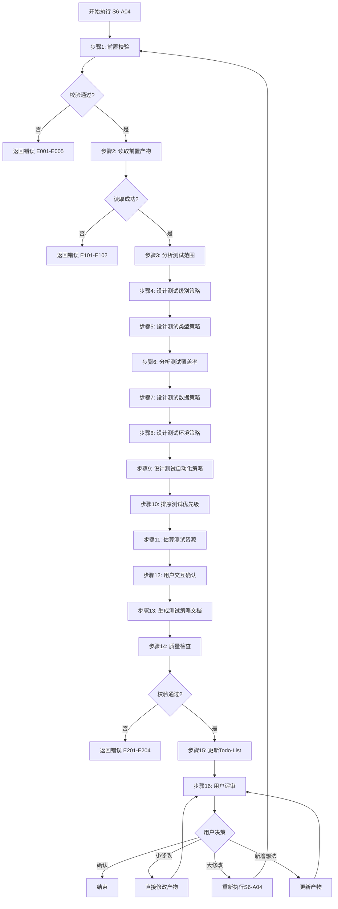
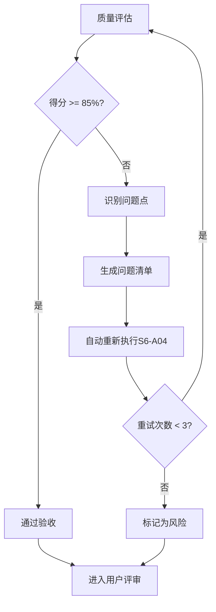

# S6-A04: 测试策略设计

## Section 1: 元信息 (Meta Information)

| 项目 | 内容 |
|------|------|
| **Skill 编号** | S6-A04 |
| **Skill 名称** | 测试策略设计 |
| **Skill 英文名称** | Test Strategy Design |
| **所属阶段** | S6 - 详细设计阶段 |
| **执行顺序** | S6 阶段第 4 个执行 |
| **执行模式** | 自动推导 + 用户交互 |
| **依赖 Skill** | S6-A01 (模块详细设计), S6-A02 (数据库详细设计), S6-A03 (UI/UX设计) |
| **后置 Skill** | 无（S6 阶段最后执行） |
| **版本** | v3.2.0 |
| **最后更新时间** | 2026-03-29 |
| **参考标准** | ISO/IEC 29119, IEEE 829, ISTQB |

## Section 2: 功能描述 (Functional Description)

### 2.1 核心职责

S6-A04 负责基于详细设计产物制定完整的测试策略，为测试团队提供可执行的测试计划。主要职责包括：

1. **测试范围分析**：基于需求规格和详细设计，识别测试范围和测试对象
2. **测试级别设计**：定义单元测试、集成测试、系统测试、验收测试策略
3. **测试类型设计**：定义功能测试、非功能测试（性能、安全、兼容性等）策略
4. **测试覆盖率分析**：计算功能覆盖率、代码覆盖率、风险覆盖率
5. **测试数据策略**：定义测试数据准备、脱敏、管理策略
6. **测试环境策略**：定义测试环境规划、配置管理策略
7. **测试自动化策略**：识别自动化测试机会，定义自动化测试框架
8. **测试优先级排序**：基于风险评估确定测试优先级
9. **测试资源估算**：估算测试工作量、人力需求、时间安排
10. **测试质量指标**：定义测试质量指标和验收标准

### 2.2 输入规范 (Input Specifications)

#### 用户/前置 Skill 需要提供什么

**前置产物（必需）**：

| 阶段 | 产物名称 | 产物 ID 示例 | 用途 |
|------|---------|-------------|------|
| S4 | 核心需求提取 | `{PlanID}-S4-S403-001` | 获取功能需求清单 |
| S4 | 非功能需求定义 | `{PlanID}-S3-S303-001` | 获取非功能需求（性能、安全等） |
| S5 | 架构视图设计 | `{PlanID}-S5-A02-001` | 获取系统架构、模块划分 |
| S6 | 模块详细设计 | `{PlanID}-S6-A01-001` | 获取类设计、方法签名 |
| S6 | 数据库详细设计 | `{PlanID}-S6-A02-001` | 获取数据模型、表结构 |
| S6 | UI/UX设计 | `{PlanID}-S6-A03-001` | 获取界面设计、交互流程 |

**输入格式**：
- Markdown 报告文件
- 功能需求列表
- 非功能需求指标
- 架构设计文档
- 详细设计文档

**输入验证规则**：
- 所有前置产物必须存在且状态为 completed
- 核心需求必须包含功能描述
- 非功能需求必须包含量化指标

#### 输入示例

**前置产物引用示例**：

```
PlanID: P000001
前置产物：
- P000001-S4-S403-001 (核心需求提取)
- P000001-S3-S303-001 (非功能需求定义)
- P000001-S5-A02-001 (架构视图设计)
- P000001-S6-A01-001 (模块详细设计)
- P000001-S6-A02-001 (数据库详细设计)
- P000001-S6-A03-001 (UI/UX设计)
```

### 2.3 输出规范 (Output Specifications)

#### 用户会得到什么

Skill 完成后，系统会生成以下产物并保存到项目目录：

**产物清单**：

| 产物名称 | 文件位置 | 格式 | 用途 | 用户可见性 |
|---------|---------|------|------|-----------|
| 测试策略文档 | `artifacts/stages/s6/{PlanID}/{PlanID}-S6-A04-001.md` | Markdown | 测试级别、类型、覆盖率、自动化策略完整文档 | 用户可查看 |
| Todo-List 更新 | `artifacts/plans/{PlanID}/todo-list.md` | Markdown | 任务状态更新 | 用户可查看 |

**产物内容结构**：

1. **测试范围概述**：测试目标、测试范围、排除范围
2. **测试级别策略**：单元测试、集成测试、系统测试、验收测试策略
3. **测试类型策略**：功能测试、性能测试、安全测试、兼容性测试等
4. **测试覆盖率分析**：功能覆盖率、代码覆盖率目标
5. **测试数据策略**：测试数据准备方案、数据脱敏规则
6. **测试环境策略**：环境规划、配置管理
7. **测试自动化策略**：自动化范围、框架选择、工具推荐
8. **测试优先级矩阵**：风险评估、优先级排序
9. **测试资源估算**：工作量估算、人力需求、时间计划
10. **测试质量指标**：质量指标定义、验收标准

#### 输出示例

**测试策略文档示例结构**：

```markdown
# 测试策略设计 - P000001-S6-A04-001

## 基本信息
- **Plan ID**: P000001
- **Skill ID**: S6-A04
- **执行时间**: 2026-03-29 16:00

## 测试范围概述

### 测试目标
验证订单管理系统满足功能需求和非功能需求

### 测试范围
| 范围类型 | 包含内容 | 排除内容 |
|---------|---------|---------|
| 功能范围 | 订单创建、订单查询、订单取消 | 第三方支付集成 |
| 模块范围 | 订单模块、用户模块 | 报表模块 |

## 测试级别策略

### 单元测试策略
| 项目 | 策略 |
|------|------|
| 覆盖率目标 | 80% 代码覆盖率 |
| 测试框架 | JUnit 5 + Mockito |
| Mock策略 | 外部依赖全部 Mock |

### 集成测试策略
| 项目 | 策略 |
|------|------|
| 测试范围 | 模块间接口、数据库交互 |
| 测试框架 | Spring Boot Test |
| 数据策略 | 使用测试数据库 |

## 测试自动化策略

### 自动化范围
| 测试类型 | 自动化比例 | 工具选择 |
|---------|-----------|---------|
| 单元测试 | 100% | JUnit 5 |
| API测试 | 80% | Postman + Newman |
| UI测试 | 60% | Cypress |
```

## Section 3: 执行流程 (Execution Process)

### 3.1 流程概览



### 3.2 详细步骤说明

详细执行步骤参见 [references/execution-details.md](references/execution-details.md)

### 3.3 Todo-List 更新规则

**更新时机与内容**：

| 执行阶段 | 更新时机 | 更新内容 |
|---------|---------|---------|
| Skill 执行开始 | 步骤 1 完成后 | S6-A04 任务状态：待执行 → 执行中 |
| 用户交互后 | 步骤 12 完成后 | 更新决策记录（如有） |
| Skill 执行完成 | 步骤 15 完成后 | S6-A04 任务状态：执行中 → 已完成，评审状态：待评审 |
| 用户评审后 | 步骤 16 完成后 | 根据评审结果更新状态 |

**用户评审后的状态更新**：

| 评审结果 | 任务状态 | 评审状态 | 断点续跑信息 |
|---------|---------|---------|-------------|
| 确认 | 已评审 | 已通过 | 可恢复=false |
| 小修改 | 执行中 | 需修改 | 可恢复=true |
| 大修改 | 执行中 | 需重做 | 可恢复=true |
| 新增想法 | 执行中 | 需修改 | 可恢复=true |

**详细规则**：详见 [execution-flow-standard.md](references/execution-flow-standard.md) 中的"Todo-List更新规则"章节。

### 3.4 Demo 示例

参见 [references/examples.md](references/examples.md)

## Section 4: 产物规范 (Artifact Specifications)

S6-A04 产物规范遵循 [references/artifact-specifications.md](references/artifact-specifications.md) 中的通用定义。

### 4.1 S6-A04 特定产物清单

| 产物名称 | 产物 ID | 存储路径 | 说明 |
|---------|---------|----------|------|
| 测试策略文档 | `{PlanID}-S6-A04-001` | `artifacts/stages/s6/{PlanID}/{PlanID}-S6-A04-001.md` | 主产物，包含测试级别、类型、覆盖率、自动化策略 |

### 4.2 依赖关系

**上游依赖**：

| 产物 ID | 来源 Skill | 用途 |
|---------|-----------|------|
| `{PlanID}-S4-S403-001` | S4-S403 核心需求提取 | 获取功能需求清单 |
| `{PlanID}-S3-S303-001` | S3-S303 非功能需求定义 | 获取非功能需求指标 |
| `{PlanID}-S5-A02-001` | S5-A02 架构视图设计 | 获取系统架构、模块划分 |
| `{PlanID}-S6-A01-001` | S6-A01 模块详细设计 | 获取类设计、方法签名 |
| `{PlanID}-S6-A02-001` | S6-A02 数据库详细设计 | 获取数据模型、表结构 |
| `{PlanID}-S6-A03-001` | S6-A03 UI/UX设计 | 获取界面设计、交互流程 |

**下游消费**：

| 消费方 | 消费内容 |
|--------|----------|
| 测试团队 | 测试策略指导测试执行 |
| 开发团队 | 单元测试指导 |

### 4.3 模板引用

**模板文件**：`skills/s6-test-strategy/template.md`

**引用方式**：直接引用模板结构，填充实际数据

## Section 5: 质量标准 (Quality Standards)

### 5.1 质量评估框架

S6-A04 遵循 [references/quality-standard.md](references/quality-standard.md) 中的 ISO/IEC 25010 质量评估框架。

**S6-A04 特定权重分配**：

| 维度 | 权重 | 验收阈值 |
|------|------|----------|
| **完整性** | 35% | ≥ 90% |
| **准确性** | 25% | ≥ 90% |
| **一致性** | 15% | ≥ 95% |
| **可读性** | 15% | ≥ 85% |
| **可追溯性** | 10% | ≥ 90% |

**验收门槛**：质量综合得分 ≥ 85%

### 5.2 S6-A04 特定检查清单

**完整性检查**（35%）：

- [ ] 所有功能需求都有对应的测试策略
- [ ] 所有非功能需求都有对应的测试类型
- [ ] 测试级别策略完整（单元/集成/系统/验收）
- [ ] 测试覆盖率目标明确
- [ ] 测试资源估算完整

**准确性检查**（25%）：

- [ ] 测试覆盖率目标合理可达成
- [ ] 测试优先级排序基于风险评估
- [ ] 自动化策略与项目特点匹配
- [ ] 资源估算有依据

**一致性检查**（15%）：

- [ ] 测试策略与架构设计一致
- [ ] 测试范围与需求范围一致
- [ ] 测试类型命名风格一致

**可读性检查**（15%）：

- [ ] 测试策略描述清晰
- [ ] 表格和图表使用恰当
- [ ] 文档结构清晰

**可追溯性检查**（10%）：

- [ ] 测试用例与需求映射关系清晰
- [ ] 与 S4-S6 阶段产物的关联明确

### 5.3 质量综合得分计算

```
得分 = Σ(维度得分 × 维度权重)

示例：
- 完整性：95% × 35% = 33.25
- 准确性：90% × 25% = 22.50
- 一致性：100% × 15% = 15.00
- 可读性：90% × 15% = 13.50
- 可追溯性：95% × 10% = 9.50
- 总分：33.25 + 22.50 + 15.00 + 13.50 + 9.50 = 93.75%
```

### 5.4 验收标准

| 结果 | 标准 | 处理方式 |
|------|------|----------|
| **通过** | 质量综合得分 ≥ 85% | 进入用户评审阶段 |
| **不通过** | 质量综合得分 < 85% | 识别问题 → 生成问题清单 → 自动重新执行 |

### 5.5 不达标处理流程



**重试机制**：
- 第1次：自动重新执行，尝试修复问题
- 第2次：自动重新执行，调整参数
- 第3次：自动重新执行，简化复杂部分
- 仍不达标：标记为风险，进入用户评审并提示问题

## Section 6: 异常处理

### 6.1 常见异常场景

**前置校验失败**（如输入文件不存在）：
- 提示用户先执行前置 Skill
- 或请求补充必要信息

**执行过程异常**（如处理逻辑失败）：
- 自动重试（最多3次）
- 失败后标记风险继续执行

**后置校验失败**（如产物不完整）：
- 重新生成产物
- 或标记为风险进入用户评审

**用户评审未通过**：
- 根据意见修改产物
- 小修改直接编辑，大修改重新执行

### 6.2 本 Skill 特定异常场景

| 异常场景 | 错误代码 | 处理策略 |
|----------|----------|----------|
| 需求覆盖率计算失败 | E161 | 使用默认覆盖率目标，标记为需人工确认 |
| 测试工具选择冲突 | E162 | 列出候选工具，请求用户选择 |
| 资源估算数据不足 | E163 | 使用类比估算，标记为粗略估算 |
| 自动化可行性不确定 | E164 | 标记为需评估，建议人工判断 |
| 测试环境依赖复杂 | E165 | 简化环境策略，建议分阶段实施 |

### 6.3 恢复策略

| 异常类型 | 处理策略 |
|----------|----------|
| 可重试异常 | 自动重试3次 |
| 数据缺失 | 请求用户补充 |
| 校验失败 | 重新执行或标记风险 |
| 用户拒绝 | 使用默认方案继续 |

### 6.4 用户交互协议

**交互时机**：在步骤 12 触发用户交互，以下场景需要用户确认：

1. **测试工具选择**：当存在多个候选工具时
2. **自动化范围确定**：当自动化成本效益不确定时
3. **测试优先级调整**：当风险评估结果需要调整时
4. **资源估算确认**：当估算偏差较大时

**使用模板**：
- 使用 [user-interaction/clarification-template.md](references/user-interaction/clarification-template.md) 进行信息澄清
- 使用 [user-interaction/option-selection-template.md](references/user-interaction/option-selection-template.md) 进行选项选择

详细流程参见 [execution-flow-standard.md](references/execution-flow-standard.md)

---

**本 Skill 符合 ISO/IEC 29119 测试标准，遵循 ISTQB 测试原则**
