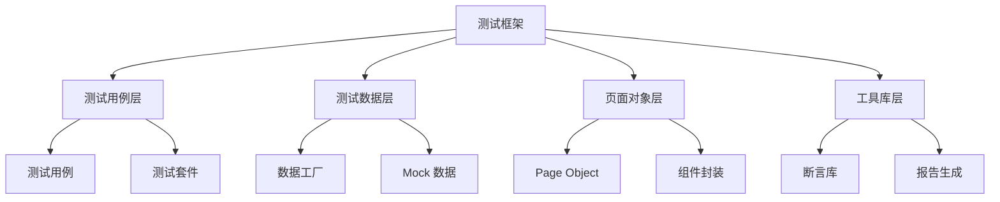
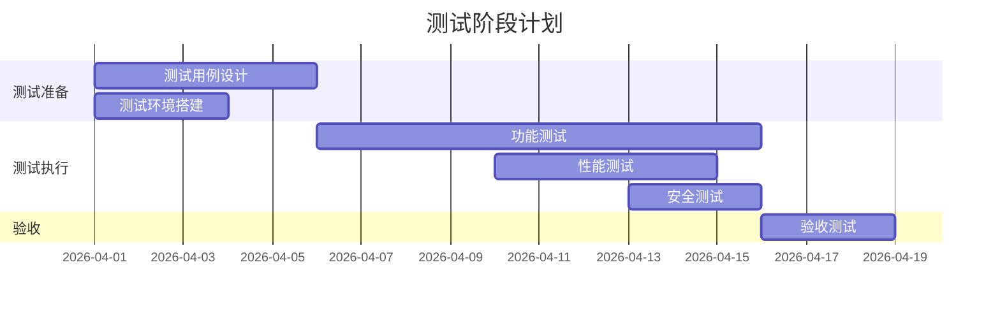

# S6-A04 Demo 示例

## 示例背景

**项目名称**：智能待办事项管理系统
**Plan ID**：P000001
**执行时间**：2026-03-29

---

## 示例 1: 测试范围分析

### 输入数据

**核心功能需求**：
- R001: 用户注册登录
- R002: 待办事项创建
- R003: 待办事项编辑
- R004: 待办事项删除
- R005: 待办事项分类
- R006: 待办事项搜索
- R007: 待办事项提醒
- R008: 数据统计分析

**非功能需求**：
- 响应时间 < 2秒
- 支持 1000 并发用户
- 数据安全加密存储

### 输出示例

```markdown
## 测试范围定义

| 范围类型 | 包含内容 | 排除内容 | 排除原因 |
|---------|---------|---------|---------|
| 功能范围 | R001-R008 全部功能 | 无 | - |
| 模块范围 | 用户模块、待办模块、统计模块 | 第三方登录集成 | 依赖第三方服务 |
| 接口范围 | 全部 REST API | Webhook 回调 | 本期不实现 |
```

---

## 示例 2: 测试级别策略

### 单元测试策略示例

```markdown
### 2.1 单元测试策略

| 项目 | 策略定义 |
|------|---------|
| **测试范围** | Service 层业务逻辑、工具类方法 |
| **覆盖率目标** | 代码覆盖率 80%，核心模块 90% |
| **测试框架** | JUnit 5 + Mockito |
| **Mock策略** | 数据库访问层 Mock，外部 API Mock |
| **执行频率** | 每次代码提交触发 CI |

#### 单元测试重点模块

| 模块 | 测试重点 | 预期用例数 |
|------|---------|-----------|
| UserService | 用户认证、权限校验 | 25 |
| TodoService | 待办 CRUD、状态流转 | 40 |
| StatisticsService | 统计计算、数据聚合 | 15 |
```

### 集成测试策略示例

```markdown
### 2.2 集成测试策略

| 项目 | 策略定义 |
|------|---------|
| **测试范围** | 模块间接口、数据库交互 |
| **集成方式** | 增量集成（自底向上） |
| **测试框架** | Spring Boot Test + TestContainers |
| **数据策略** | 使用 TestContainers 启动测试数据库 |

#### 集成测试场景

| 场景 ID | 场景描述 | 涉及模块 | 优先级 |
|---------|---------|---------|--------|
| IT-001 | 用户创建待办事项 | UserService + TodoService | P0 |
| IT-002 | 待办事项触发统计更新 | TodoService + StatisticsService | P1 |
| IT-003 | 批量导入待办事项 | TodoService + FileService | P2 |
```

---

## 示例 3: 测试类型策略

### 性能测试示例

```markdown
#### 3.2.1 性能测试

| 测试类型 | 目标指标 | 测试工具 | 执行时机 |
|---------|---------|---------|---------|
| 负载测试 | TPS ≥ 100，响应时间 < 2s | JMeter | 迭代结束前 |
| 压力测试 | 支持 1000 并发用户 | JMeter | 发布前 |
| 稳定性测试 | 持续运行 24h 无异常 | JMeter | 发布前 |

##### 性能测试场景设计

| 场景 ID | 场景描述 | 并发用户数 | 持续时间 | 通过标准 |
|---------|---------|-----------|---------|---------|
| PT-001 | 用户登录 | 100 | 10min | 响应时间 < 1s |
| PT-002 | 创建待办 | 50 | 10min | 响应时间 < 2s |
| PT-003 | 搜索待办 | 200 | 15min | 响应时间 < 2s |
| PT-004 | 综合场景 | 500 | 30min | 错误率 < 1% |
```

### 安全测试示例

```markdown
#### 3.2.2 安全测试

| 测试类型 | 测试内容 | 测试工具 | 优先级 |
|---------|---------|---------|--------|
| 漏洞扫描 | 全站漏洞扫描 | OWASP ZAP | P0 |
| 渗透测试 | 登录接口、数据接口 | Burp Suite | P1 |
| 权限测试 | 越权访问测试 | 手工测试 | P0 |

##### 安全测试检查项

| 检查项 | 测试方法 | 预期结果 |
|--------|---------|---------|
| SQL注入 | 输入恶意 SQL 语句 | 系统拦截并返回错误 |
| XSS攻击 | 输入恶意脚本 | 系统转义处理 |
| 越权访问 | 修改请求参数访问他人数据 | 返回权限不足 |
| 敏感数据加密 | 检查数据库存储 | 密码等敏感数据加密 |
```

---

## 示例 4: 测试覆盖率分析

```markdown
## 四、测试覆盖率分析

### 4.1 功能覆盖率

| 需求类型 | 总数 | 覆盖数 | 覆盖率 |
|---------|------|--------|--------|
| 功能需求 | 8 | 8 | 100% |
| 非功能需求 | 5 | 5 | 100% |
| 业务规则 | 15 | 15 | 100% |

### 4.2 代码覆盖率目标

| 覆盖类型 | 目标值 | 度量方式 |
|---------|--------|---------|
| 行覆盖率 | 80% | JaCoCo |
| 分支覆盖率 | 70% | JaCoCo |
| 方法覆盖率 | 90% | JaCoCo |

### 4.3 风险覆盖率

| 风险等级 | 风险数量 | 测试覆盖数 | 覆盖率 |
|---------|---------|-----------|--------|
| 高风险 | 3 | 3 | 100% |
| 中风险 | 5 | 5 | 100% |
| 低风险 | 8 | 8 | 100% |
```

---

## 示例 5: 测试自动化策略

```markdown
## 七、测试自动化策略

### 7.1 自动化范围

| 测试层级 | 自动化比例 | 自动化内容 | 手动测试内容 |
|---------|-----------|-----------|-------------|
| 单元测试 | 100% | Service 层全部测试 | - |
| API测试 | 80% | 核心接口自动化 | 复杂业务场景 |
| UI测试 | 60% | 主流程自动化 | 探索性测试、视觉测试 |

### 7.2 自动化工具选择

| 测试类型 | 工具选择 | 选择理由 |
|---------|---------|---------|
| 单元测试 | JUnit 5 + Mockito | Java 生态标准，社区成熟 |
| API测试 | Postman + Newman | 易于编写，支持 CI 集成 |
| UI测试 | Cypress | 快速执行，调试友好 |
| 性能测试 | JMeter | 开源免费，功能强大 |

### 7.3 自动化框架设计


```

---

## 示例 6: 测试优先级矩阵

```markdown
## 八、测试优先级矩阵

### 8.1 风险评估

| 功能模块 | 使用频率 | 业务影响 | 技术复杂度 | 风险等级 | 测试优先级 |
|---------|---------|---------|-----------|---------|-----------|
| 用户登录 | 高 | 高 | 低 | 高 | P0 |
| 待办创建 | 高 | 高 | 中 | 高 | P0 |
| 待办编辑 | 高 | 中 | 低 | 中 | P1 |
| 待办删除 | 中 | 高 | 低 | 中 | P1 |
| 待办搜索 | 高 | 中 | 中 | 中 | P1 |
| 数据统计 | 低 | 低 | 高 | 中 | P2 |
| 待办提醒 | 中 | 中 | 高 | 中 | P1 |
| 待办分类 | 中 | 低 | 低 | 低 | P2 |

### 8.2 测试优先级排序

| 优先级 | 模块列表 | 测试策略 |
|--------|---------|---------|
| P0 | 用户登录、待办创建 | 100% 自动化 + 探索性测试 |
| P1 | 待办编辑、待办删除、待办搜索、待办提醒 | 80% 自动化 + 手动测试 |
| P2 | 数据统计、待办分类 | 关键路径自动化 + 手动测试 |
```

---

## 示例 7: 测试资源估算

```markdown
## 九、测试资源估算

### 9.1 工作量估算

| 测试活动 | 估算方法 | 估算工时（人天） |
|---------|---------|----------------|
| 测试用例设计 | 功能点数 × 0.5 | 8 |
| 测试环境搭建 | 固定估算 | 2 |
| 测试执行 | 用例数 × 0.1 | 10 |
| 缺陷验证 | 预估缺陷数 × 0.2 | 4 |
| 回归测试 | 迭代次数 × 3 | 6 |
| **合计** | - | **30** |

### 9.2 人力需求

| 角色 | 人数 | 技能要求 | 参与阶段 |
|------|------|---------|---------|
| 测试负责人 | 1 | 5年以上测试经验，熟悉自动化 | 全阶段 |
| 功能测试工程师 | 2 | 熟悉 Web 测试，会基础脚本 | 测试执行阶段 |
| 自动化测试工程师 | 1 | 熟悉 Cypress/JMeter，3年以上 | 自动化开发阶段 |

### 9.3 时间计划


```

---

## 示例 8: 用户交互场景

### 场景：测试工具选择

**触发条件**：存在多个候选工具时

**交互示例**：

```markdown
【测试策略设计 - 用户交互】

检测到 API 测试存在多个候选工具，请选择：

**选项 A：Postman + Newman**
- 优点：易于使用，可视化界面，支持团队协作
- 缺点：付费版本功能更全

**选项 B：REST Assured**
- 优点：代码化测试，易于 CI 集成，免费
- 缺点：学习曲线较陡

**选项 C：Karate**
- 优点：BDD 风格，支持 API 和 UI 测试
- 缺点：社区较小

请输入您的选择（A/B/C），或输入「其他」并说明您的偏好。
```

### 场景：自动化范围确认

**触发条件**：自动化成本效益不确定时

**交互示例**：

```markdown
【测试策略设计 - 用户交互】

根据分析，建议的 UI 自动化比例为 60%，原因如下：

**推荐自动化的场景**：
- 用户登录流程
- 待办事项 CRUD 主流程
- 搜索功能

**建议手动测试的场景**：
- 探索性测试
- 视觉回归测试
- 用户体验测试

请问您是否同意这个自动化范围？
- 输入「同意」确认
- 输入「调整」并提供调整意见
```

---

*文档版本: v3.2.0*
*最后更新: 2026-03-29*
