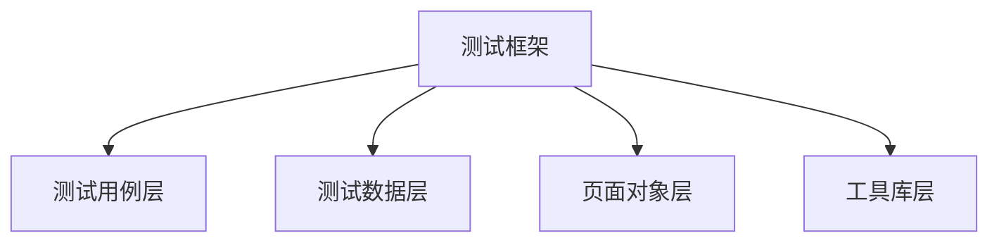
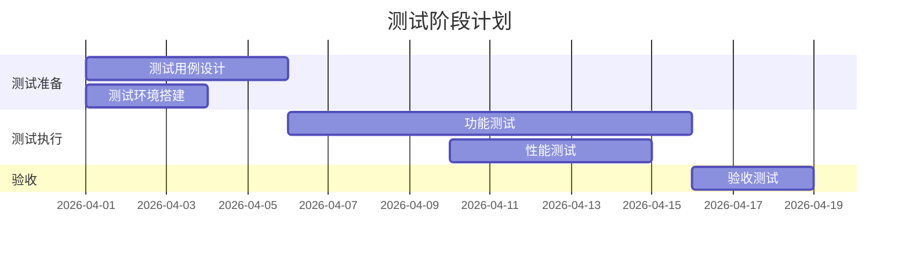

# 测试策略设计 - {PlanID}-S6-A04-{序号}

## 基本信息

| 项目 | 内容 |
|------|------|
| **Plan ID** | {PlanID} |
| **Skill ID** | S6-A04 |
| **执行时间** | {YYYY-MM-DD HH:mm} |
| **版本** | v1.0.0 |

---

## 一、测试范围概述

### 1.1 测试目标

{描述测试的总体目标}

### 1.2 测试范围定义

| 范围类型 | 包含内容 | 排除内容 | 排除原因 |
|---------|---------|---------|---------|
| 功能范围 | {包含的功能} | {排除的功能} | {排除原因} |
| 模块范围 | {包含的模块} | {排除的模块} | {排除原因} |
| 接口范围 | {包含的接口} | {排除的接口} | {排除原因} |

---

## 二、测试级别策略

### 2.1 单元测试策略

| 项目 | 策略定义 |
|------|---------|
| **测试范围** | {单元测试覆盖的代码范围} |
| **覆盖率目标** | {代码覆盖率目标，如 80%} |
| **测试框架** | {推荐的测试框架} |
| **Mock策略** | {外部依赖的 Mock 方式} |
| **执行频率** | {每次提交/每日构建} |

### 2.2 集成测试策略

| 项目 | 策略定义 |
|------|---------|
| **测试范围** | {模块间接口、数据库交互等} |
| **集成方式** | {增量集成/大爆炸集成} |
| **测试框架** | {推荐的集成测试框架} |
| **数据策略** | {测试数据准备方式} |

### 2.3 系统测试策略

| 项目 | 策略定义 |
|------|---------|
| **测试范围** | {端到端业务流程} |
| **测试环境** | {类生产环境} |
| **测试数据** | {生产级测试数据} |
| **执行时机** | {迭代结束前/发布前} |

### 2.4 验收测试策略

| 项目 | 策略定义 |
|------|---------|
| **测试类型** | {UAT/Alpha/Beta} |
| **参与人员** | {用户/PO/测试人员} |
| **验收标准** | {验收通过的准则} |

---

## 三、测试类型策略

### 3.1 功能测试

| 功能模块 | 测试要点 | 优先级 | 自动化 |
|---------|---------|--------|--------|
| {模块1} | {测试要点} | P0/P1/P2 | 是/否 |
| {模块2} | {测试要点} | P0/P1/P2 | 是/否 |

### 3.2 非功能测试

#### 3.2.1 性能测试

| 测试类型 | 目标指标 | 测试工具 | 执行时机 |
|---------|---------|---------|---------|
| 负载测试 | {TPS、响应时间} | {工具名称} | {时机} |
| 压力测试 | {并发用户数} | {工具名称} | {时机} |
| 稳定性测试 | {持续运行时间} | {工具名称} | {时机} |

#### 3.2.2 安全测试

| 测试类型 | 测试内容 | 测试工具 | 优先级 |
|---------|---------|---------|--------|
| 漏洞扫描 | {扫描范围} | {工具名称} | P0 |
| 渗透测试 | {测试范围} | {工具名称} | P1 |
| 权限测试 | {测试内容} | {工具名称} | P0 |

#### 3.2.3 兼容性测试

| 维度 | 测试范围 | 优先级 |
|------|---------|--------|
| 浏览器 | {Chrome, Firefox, Safari 等} | P1 |
| 操作系统 | {Windows, macOS, Linux 等} | P1 |
| 设备 | {PC, Mobile, Tablet 等} | P2 |

---

## 四、测试覆盖率分析

### 4.1 功能覆盖率

| 需求类型 | 总数 | 覆盖数 | 覆盖率 |
|---------|------|--------|--------|
| 功能需求 | {N} | {M} | {M/N}% |
| 非功能需求 | {N} | {M} | {M/N}% |
| 业务规则 | {N} | {M} | {M/N}% |

### 4.2 代码覆盖率目标

| 覆盖类型 | 目标值 | 度量方式 |
|---------|--------|---------|
| 行覆盖率 | {如 80%} | JaCoCo |
| 分支覆盖率 | {如 70%} | JaCoCo |
| 方法覆盖率 | {如 90%} | JaCoCo |

### 4.3 风险覆盖率

| 风险等级 | 风险数量 | 测试覆盖数 | 覆盖率 |
|---------|---------|-----------|--------|
| 高风险 | {N} | {M} | {M/N}% |
| 中风险 | {N} | {M} | {M/N}% |
| 低风险 | {N} | {M} | {M/N}% |

---

## 五、测试数据策略

### 5.1 测试数据来源

| 数据类型 | 来源 | 获取方式 |
|---------|------|---------|
| 基础数据 | {来源} | {获取方式} |
| 业务数据 | {来源} | {获取方式} |
| 边界数据 | {来源} | {获取方式} |

### 5.2 数据脱敏规则

| 数据字段 | 脱敏规则 | 说明 |
|---------|---------|------|
| {字段1} | {脱敏规则} | {说明} |
| {字段2} | {脱敏规则} | {说明} |

### 5.3 测试数据管理

| 管理项 | 策略 |
|--------|------|
| 数据版本 | {版本控制方式} |
| 数据恢复 | {恢复策略} |
| 数据隔离 | {隔离方式} |

---

## 六、测试环境策略

### 6.1 环境规划

| 环境类型 | 用途 | 配置要求 | 访问权限 |
|---------|------|---------|---------|
| 开发环境 | 开发自测 | {配置} | 开发团队 |
| 测试环境 | 功能测试 | {配置} | 测试团队 |
| 预发环境 | 验收测试 | {配置} | 项目组 |
| 生产环境 | 线上运行 | {配置} | 运维团队 |

### 6.2 配置管理

| 管理项 | 策略 |
|--------|------|
| 环境配置 | {配置管理方式} |
| 数据库配置 | {数据库管理策略} |
| 中间件配置 | {中间件管理策略} |

---

## 七、测试自动化策略

### 7.1 自动化范围

| 测试层级 | 自动化比例 | 自动化内容 | 手动测试内容 |
|---------|-----------|-----------|-------------|
| 单元测试 | {如 100%} | {内容} | {内容} |
| API测试 | {如 80%} | {内容} | {内容} |
| UI测试 | {如 60%} | {内容} | {内容} |

### 7.2 自动化工具选择

| 测试类型 | 工具选择 | 选择理由 |
|---------|---------|---------|
| 单元测试 | {工具} | {理由} |
| API测试 | {工具} | {理由} |
| UI测试 | {工具} | {理由} |
| 性能测试 | {工具} | {理由} |

### 7.3 自动化框架设计

---

## 八、测试优先级矩阵

### 8.1 风险评估

| 功能模块 | 使用频率 | 业务影响 | 技术复杂度 | 风险等级 | 测试优先级 |
|---------|---------|---------|-----------|---------|-----------|
| {模块1} | 高/中/低 | 高/中/低 | 高/中/低 | 高/中/低 | P0/P1/P2 |
| {模块2} | 高/中/低 | 高/中/低 | 高/中/低 | 高/中/低 | P0/P1/P2 |

### 8.2 测试优先级排序

| 优先级 | 模块列表 | 测试策略 |
|--------|---------|---------|
| P0 | {模块列表} | 100% 自动化 + 探索性测试 |
| P1 | {模块列表} | 80% 自动化 + 手动测试 |
| P2 | {模块列表} | 关键路径自动化 + 手动测试 |

---

## 九、测试资源估算

### 9.1 工作量估算

| 测试活动 | 估算方法 | 估算工时（人天） |
|---------|---------|----------------|
| 测试用例设计 | {方法} | {工时} |
| 测试环境搭建 | {方法} | {工时} |
| 测试执行 | {方法} | {工时} |
| 缺陷验证 | {方法} | {工时} |
| 回归测试 | {方法} | {工时} |
| **合计** | - | **{总工时}** |

### 9.2 人力需求

| 角色 | 人数 | 技能要求 | 参与阶段 |
|------|------|---------|---------|
| 测试负责人 | {N} | {要求} | 全阶段 |
| 功能测试工程师 | {N} | {要求} | 测试执行阶段 |
| 自动化测试工程师 | {N} | {要求} | 自动化开发阶段 |
| 性能测试工程师 | {N} | {要求} | 性能测试阶段 |

### 9.3 时间计划

---

## 十、测试质量指标

### 10.1 过程指标

| 指标名称 | 目标值 | 度量方式 |
|---------|--------|---------|
| 用例执行率 | 100% | 已执行/总数 |
| 用例通过率 | ≥ 95% | 通过/已执行 |
| 缺陷发现率 | {目标} | 缺陷数/KLOC |
| 缺陷修复率 | ≥ 98% | 已修复/总数 |

### 10.2 产品指标

| 指标名称 | 目标值 | 度量方式 |
|---------|--------|---------|
| 缺陷密度 | ≤ 0.5/KLOC | 缺陷数/代码行数 |
| 严重缺陷率 | ≤ 5% | 严重缺陷/总缺陷 |
| 缺陷重开率 | ≤ 5% | 重开缺陷/已关闭 |

### 10.3 验收标准

| 标准 | 要求 |
|------|------|
| 功能验收 | 所有 P0/P1 用例通过 |
| 性能验收 | 满足性能指标要求 |
| 安全验收 | 无高危漏洞 |
| 兼容性验收 | 覆盖目标平台 |

---

## 附录

### A. 测试用例清单

{引用详细测试用例文档}

### B. 测试数据清单

{引用测试数据文档}

### C. 缺陷模板

| 字段 | 说明 |
|------|------|
| 标题 | {缺陷简述} |
| 严重程度 | 致命/严重/一般/轻微 |
| 优先级 | P0/P1/P2/P3 |
| 重现步骤 | {步骤描述} |
| 预期结果 | {预期} |
| 实际结果 | {实际} |

---

*文档生成时间: {YYYY-MM-DD HH:mm}*
*Skill 版本: v3.2.0*
