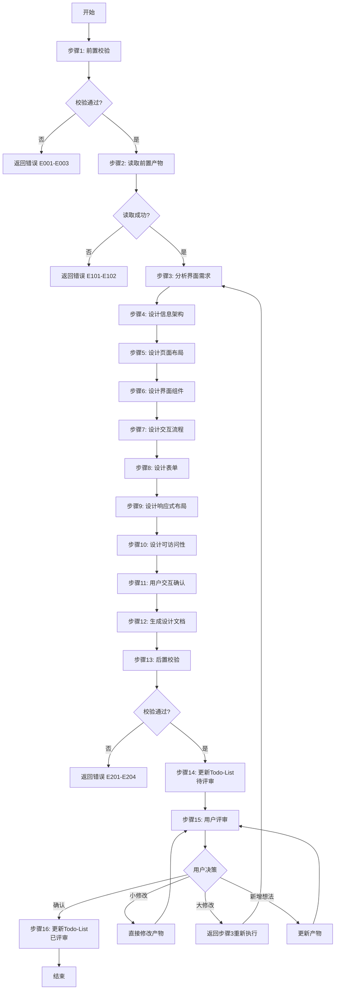
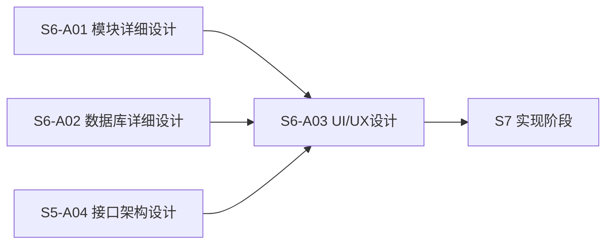
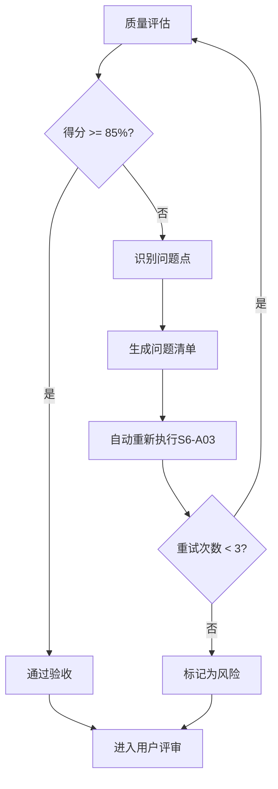

# S6-A03: UI/UX 设计

## Section 1: 元信息 (Meta Information)

| 项目 | 内容 |
|------|------|
| **Skill ID** | S6-A03 |
| **Skill 名称** | UI/UX 设计 |
| **Skill 英文名称** | UI/UX Design |
| **所属阶段** | S6 - 详细设计 |
| **执行顺序** | S6 阶段第 3 个执行 |
| **执行模式** | 自动推导 + 用户交互 |
| **存储目录** | skills/s6-uiux |
| **依赖 Skill** | S6-A02（数据库详细设计） |
| **后置 Skill** | S6-A04 (测试策略设计) |
| **轻量化跳过** | No |
| **必需输入** | artifacts/stages/s6/{PlanID}-S6-A02-001.md |
| **输出产物** | artifacts/stages/s6/{PlanID}/{PlanID}-S6-A03-001.md, artifacts/stages/s6/{PlanID}/{PlanID}-S6-A03-002.md |

***

## Section 2: 功能描述 (Functional Description)

### 2.1 核心职责

S6-A03 负责设计系统的用户界面和交互体验，为前端开发提供完整的设计规范。主要职责包括：

1. **信息架构设计**：设计导航结构、页面清单、路由体系
2. **页面布局设计**：设计各页面的布局结构、组件布局
3. **界面组件设计**：识别并定义界面组件、属性、复用关系
4. **交互流程设计**：设计用户操作流程、状态转换、交互细节
5. **表单设计**：设计表单字段、验证规则、交互行为
6. **响应式设计**：设计多端适配方案、断点策略
7. **可访问性设计**：确保符合 WCAG 2.1 AA 级标准
8. **设计规范输出**：输出可指导前端开发的 UI/UX 设计文档

### 2.2 输入规范 (Input Specifications)

#### 用户/前置 Skill 需要提供什么

**前置产物（必需）**：

| 阶段 | 产物名称 | 产物 ID 示例 | 用途 |
|------|---------|-------------|------|
| S6 | 模块详细设计文档 | `{PlanID}-S6-A01-001` | 获取功能需求、业务流程 |
| S6 | 数据库详细设计文档 | `{PlanID}-S6-A02-001` | 获取数据结构、字段信息 |
| S5 | 接口架构设计文档 | `{PlanID}-S5-A04-001` | 获取 API 定义、交互规范 |
| S1-S4 | 需求规格说明书 | 多个产物 | 获取用户故事、用例描述 |
| S1-S4 | 非功能需求 | 多个产物 | 获取性能、可用性要求 |

**输入格式**：
- Markdown 报告文件
- 结构化数据表格
- Mermaid 图表

**输入验证规则**：
- 所有前置产物必须存在且状态为 completed
- 产物 ID 必须匹配且连续
- Markdown 报告必须结构完整

#### 输入示例

**前置产物引用示例**：

```
PlanID: P000001
前置产物：
- P000001-S6-A01-001 (模块详细设计文档)
- P000001-S6-A02-001 (数据库详细设计文档)
- P000001-S5-A04-001 (接口架构设计文档)
```

### 2.3 输出规范 (Output Specifications)

#### 用户会得到什么

Skill 完成后，系统会生成以下产物并保存到项目目录：

**产物清单**：

| 产物名称 | 文件位置 | 格式 | 用途 | 用户可见性 |
|---------|---------|------|------|-----------|
| UI/UX设计文档 | `artifacts/stages/s6/{PlanID}/{PlanID}-S6-A03-001.md` | Markdown | 界面原型、交互流程、设计规范 | 用户可查看 |
| 界面组件清单 | `artifacts/stages/s6/{PlanID}/{PlanID}-S6-A03-002.md` | Markdown | 组件列表、组件属性、复用关系 | 用户可查看 |
| Todo-List 更新 | `artifacts/plans/{PlanID}/todo-list.md` | Markdown | 任务状态更新 | 用户可查看 |

**产物内容结构**：

1. **设计概述**：设计风格、设计原则、目标用户
2. **信息架构**：导航结构、页面清单、路由设计
3. **页面设计**：页面布局、组件清单、线框图
4. **交互设计**：交互流程、状态转换、交互细节
5. **组件设计**：组件清单、组件属性、复用关系
6. **响应式设计**：断点设计、适配策略、布局变化
7. **可访问性设计**：可访问性检查清单、ARIA 标签
8. **用户交互记录**：交互轮次、问题、用户输入
9. **评审记录**：评审时间、结果、意见

#### 输出示例

**UI/UX设计文档示例结构**：

```markdown
# UI/UX设计文档 - P000001-S6-A03-001

## 设计概述
- 设计风格：简洁商务风
- 主色调：品牌蓝色（#1890ff）
- 目标用户：企业办公人员

## 信息架构
- 导航结构：顶部导航 + 侧边栏
- 页面数量：18 个页面
- 路由设计：RESTful 风格

## 页面设计
- 首页：仪表板式布局
- 列表页：两栏布局
- 详情页：三栏布局

## 交互设计
- 登录流程：3 步完成
- 表单提交：实时验证
...
```

***

## Section 3: 执行流程 (Execution Process)

### 3.1 流程概览



### 3.2 详细步骤

详细步骤说明见 [references/execution-details.md](references/execution-details.md)

### 3.3 Demo 示例

执行示例见 [references/examples.md](references/examples.md)

---

## Section 4: 产物规范 (Artifact Specifications)

S6-A03 产物规范遵循 [../_shared/artifact-specifications.md](../_shared/artifact-specifications.md) 中的通用定义。

### 4.1 S6-A03 特定产物清单

| 产物名称 | 产物ID | 存储路径 | 说明 |
|---------|--------|---------|------|
| UI/UX设计文档 | `{PlanID}-S6-A03-001` | `artifacts/stages/s6/{PlanID}/{PlanID}-S6-A03-001.md` | 主产物，包含信息架构、页面设计、交互设计、响应式设计、可访问性设计 |
| 界面组件清单 | `{PlanID}-S6-A03-002` | `artifacts/stages/s6/{PlanID}/{PlanID}-S6-A03-002.md` | 副产物，包含组件清单、组件属性、复用关系 |

### 4.2 产物依赖关系



### 4.3 模板引用

**模板文件**：`skills/s6-uiux/template.md`

**引用方式**：直接引用模板结构，填充实际数据

---

## Section 5: 质量标准 (Quality Standards)

### 5.1 质量评估框架

S6-A03 遵循 [../_shared/quality-standard.md](../_shared/quality-standard.md) 中的 ISO/IEC 25010 质量评估框架。

**S6-A03 特定权重分配**：

| 维度 | 权重 | 验收阈值 |
|------|------|----------|
| **完整性** | 30% | ≥ 90% |
| **准确性** | 25% | ≥ 90% |
| **一致性** | 20% | ≥ 95% |
| **可读性** | 15% | ≥ 85% |
| **可追溯性** | 10% | ≥ 90% |

**验收门槛**：质量综合得分 ≥ 85%

### 5.2 检查清单

**完整性检查**（30%）：
- [ ] 信息架构完整（导航结构、页面清单、路由设计）
- [ ] 页面设计完整（所有页面都有布局说明）
- [ ] 交互设计完整（关键流程都有交互说明）
- [ ] 组件清单完整（组件分类、属性、复用关系）
- [ ] 响应式设计完整（断点、适配策略）
- [ ] 可访问性设计完整（WCAG 检查清单）

**准确性检查**（25%）：
- [ ] 页面布局与功能需求一致
- [ ] 表单字段与数据库字段对应
- [ ] 交互流程与业务流程一致
- [ ] 组件选择与技术栈匹配
- [ ] 可访问性符合 WCAG 2.1 AA 标准

**一致性检查**（20%）：
- [ ] 设计风格统一
- [ ] 组件命名规范统一
- [ ] 色彩体系一致
- [ ] 交互模式一致
- [ ] 文档格式统一

**可读性检查**（15%）：
- [ ] 布局示意图清晰（Mermaid 图）
- [ ] 交互流程图清晰
- [ ] 表格格式规范
- [ ] 描述语言简洁明了

**可追溯性检查**（10%）：
- [ ] 页面与功能模块关联
- [ ] 组件与设计需求关联
- [ ] 交互流程与用例关联
- [ ] 设计决策有依据

### 5.3 质量综合得分计算

```
得分 = Σ(维度得分 × 维度权重)

示例：
- 完整性：95% × 30% = 28.5
- 准确性：90% × 25% = 22.5
- 一致性：100% × 20% = 20.0
- 可读性：90% × 15% = 13.5
- 可追溯性：95% × 10% = 9.5
- 总分：28.5 + 22.5 + 20.0 + 13.5 + 9.5 = 94.0%
```

### 5.4 验收标准

| 结果 | 标准 | 处理方式 |
|------|------|----------|
| **通过** | 质量综合得分 ≥ 85% | 进入用户评审阶段 |
| **不通过** | 质量综合得分 < 85% | 识别问题 → 生成问题清单 → 自动重新执行 |

### 5.5 不达标处理流程



**重试机制**：
- 第1次：自动重新执行，尝试修复问题
- 第2次：自动重新执行，调整参数
- 第3次：自动重新执行，简化复杂部分
- 仍不达标：标记为风险，进入用户评审并提示问题

---

## Section 6: 异常处理

### 常见异常场景

**前置校验失败**（如输入文件不存在）：
- 提示用户先执行前置 Skill
- 或请求补充必要信息

**执行过程异常**（如处理逻辑失败）：
- 自动重试（最多3次）
- 失败后标记风险继续执行

**后置校验失败**（如产物不完整）：
- 重新生成产物
- 或标记为风险进入用户评审

**用户评审未通过**：
- 根据意见修改产物
- 小修改直接编辑，大修改重新执行

### 本 Skill 特定场景

| 场景 | 处理策略 |
|------|----------|
| 设计风格不明确 | 提供选项供用户选择（简洁商务/现代科技/温暖亲和） |
| 组件库选择冲突 | 基于技术栈推荐，提供选项供用户选择 |
| 响应式优先级不明确 | 提供选项供用户选择（桌面优先/移动优先/均衡策略） |
| 交互复杂度选择困难 | 提供简单/丰富交互选项供用户选择 |
| 页面布局争议 | 标记待确认，提供多种方案供用户选择 |

### 恢复策略

| 异常类型 | 处理策略 |
|----------|----------|
| 可重试异常 | 自动重试3次 |
| 数据缺失 | 请求用户补充 |
| 校验失败 | 重新执行或标记风险 |
| 用户拒绝 | 使用默认值继续 |

详细流程参见 [execution-flow-standard.md](../_shared/execution-flow-standard.md)

---

**本 Skill 符合 WCAG 2.1 可访问性标准，遵循 ISO/IEC 25010 质量模型**
