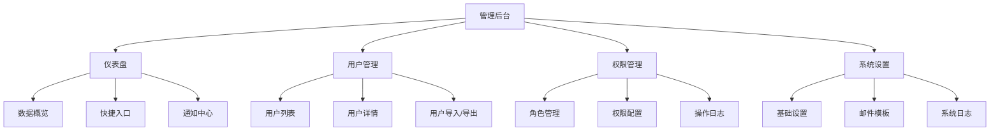
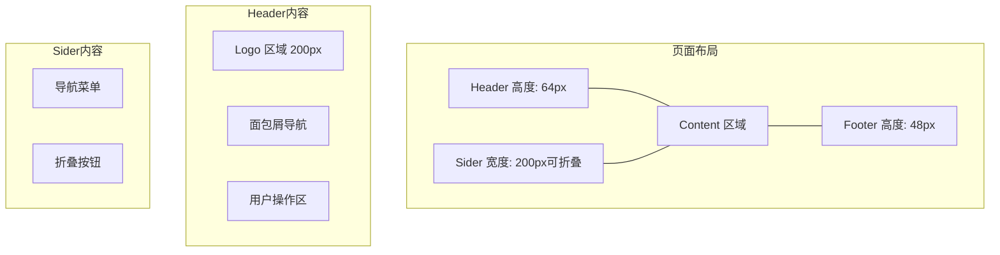
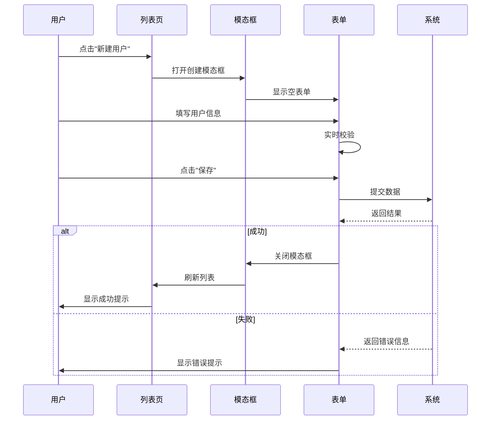
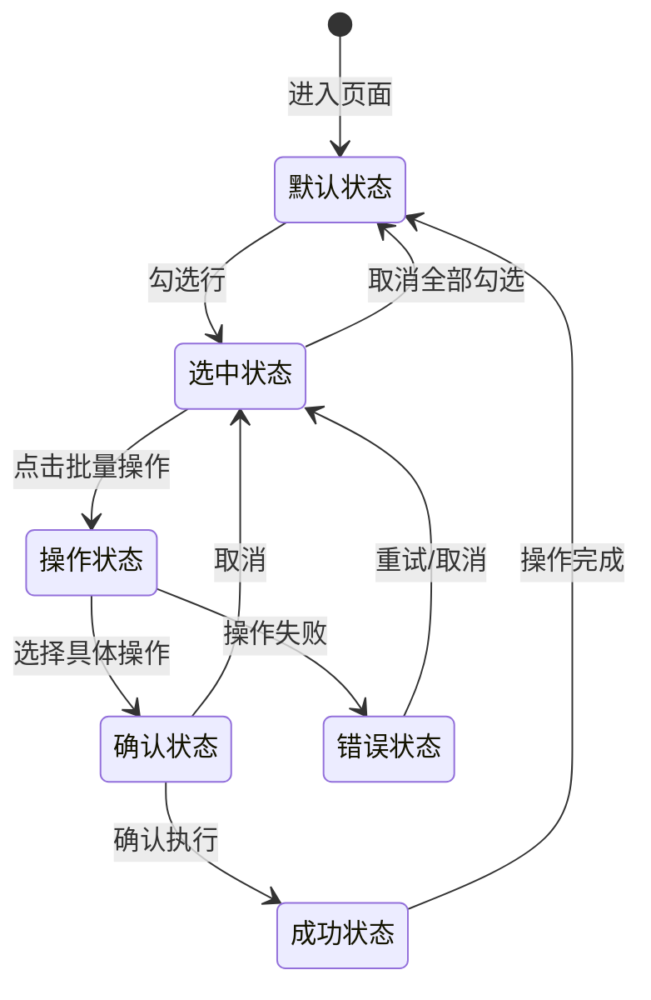
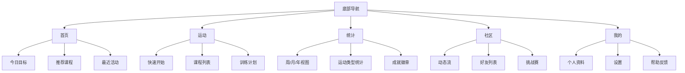
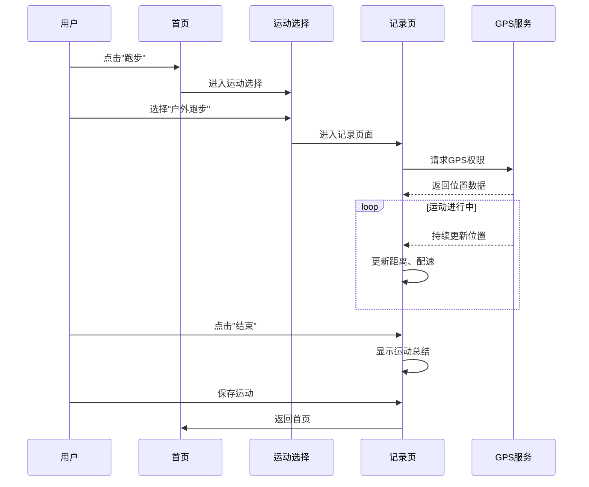

# S6-A03 UI/UX 设计 - 示例文档

本文档提供 UI/UX 设计 Skill 的执行示例，展示从需求到完整界面设计的转换过程。

---

## Demo 1：管理后台界面设计

### 场景描述
为 SaaS 平台设计管理后台界面，支持用户管理、权限配置、数据统计等功能。

### 输入示例

**前置产物：**
- 功能需求文档
- 数据模型定义
- 竞品分析报告

**需求描述：**
```markdown
## 管理后台界面需求

### 功能模块
1. 仪表盘：数据概览、快捷入口
2. 用户管理：用户列表、详情、编辑
3. 角色权限：角色管理、权限配置
4. 系统设置：基础配置、日志查看

### 用户特征
- 管理员：技术人员，熟悉系统操作
- 运营人员：非技术背景，需要简洁直观

### 设计要求
- 响应式布局：支持 1366px ~ 1920px
- 深色/浅色主题切换
- 操作反馈明确
- 支持键盘快捷键
```

### 处理过程

**步骤 1：信息架构设计**
- 组织内容层级
- 设计导航结构
- 结果：信息架构图、导航菜单

**步骤 2：页面布局设计**
- 设计页面框架
- 确定内容区域划分
- 结果：线框图、布局规范

**步骤 3：交互流程设计**
- 设计主要任务流程
- 定义状态变化
- 结果：流程图、状态图

**步骤 4：组件清单设计**
- 识别可复用组件
- 定义组件规范
- 结果：组件库清单

### 输出示例

```markdown
# S6-A03-001 管理后台界面设计

## 1. 信息架构

### 1.1 站点地图



### 1.2 导航菜单结构

```yaml
导航菜单:
  - 标题: 仪表盘
    图标: DashboardOutlined
    路径: /dashboard

  - 标题: 用户管理
    图标: UserOutlined
    路径: /users
    子菜单:
      - 标题: 用户列表
        路径: /users/list
      - 标题: 用户分组
        路径: /users/groups

  - 标题: 权限管理
    图标: SafetyOutlined
    路径: /permissions
    子菜单:
      - 标题: 角色管理
        路径: /permissions/roles
      - 标题: 权限配置
        路径: /permissions/config
      - 标题: 操作日志
        路径: /permissions/logs

  - 标题: 系统设置
    图标: SettingOutlined
    路径: /settings
```

## 2. 页面布局设计

### 2.1 整体布局框架



### 2.2 响应式断点

| 断点 | 宽度范围 | 布局调整 |
|------|----------|----------|
| xs | < 768px | 隐藏侧边栏，使用抽屉菜单 |
| sm | 768px - 992px | 侧边栏折叠为图标模式 |
| md | 992px - 1200px | 侧边栏固定 200px |
| lg | 1200px - 1600px | 侧边栏固定 220px，内容区最大 1200px |
| xl | > 1600px | 侧边栏固定 240px，内容区最大 1400px |

### 2.3 页面布局示例 - 用户列表页

```
+----------------------------------------------------------+
|  [Logo]    用户管理 / 用户列表          [通知] [用户头像]  |  Header (64px)
+----------+-----------------------------------------------+
|          |                                               |
|  仪表盘   |   页面标题: 用户列表          [新建用户]       |
|          |   -----------------------------------------   |
|  用户管理 |                                               |
|  > 用户列表|   [搜索框...] [筛选 ▼] [导出 ▼] [刷新]        |
|    用户分组|                                               |
|          |   +---------------------------------------+   |
|  权限管理 |   |  用户名   | 邮箱      | 状态 | 操作    |   |
|  系统设置 |   |---------------------------------------|   |
|          |   |  user1   | u1@e.com | 启用 | [编辑]  |   |
|          |   |  user2   | u2@e.com | 禁用 | [编辑]  |   |
|          |   |  ...     | ...      | ...  | ...     |   |
|          |   +---------------------------------------+   |
|          |                                               |
|          |   [< 1 2 3 4 5 ... 20 >]  每页 20 条         |
|          |                                               |
+----------+-----------------------------------------------+
```

## 3. 交互流程设计

### 3.1 用户创建流程



### 3.2 批量操作交互



## 4. 组件清单

### 4.1 基础组件

| 组件名称 | 用途 | 变体 | 规范文件 |
|----------|------|------|----------|
| Button | 操作触发 | 主按钮、次按钮、危险按钮、文字按钮 | button-spec.md |
| Input | 文本输入 | 普通、密码、搜索、带前缀/后缀 | input-spec.md |
| Select | 选项选择 | 单选、多选、可搜索、分组 | select-spec.md |
| Table | 数据展示 | 基础、可排序、可筛选、可展开 | table-spec.md |
| Modal | 弹窗交互 | 信息确认、表单编辑、详情展示 | modal-spec.md |
| Form | 表单容器 | 行内、垂直、水平布局 | form-spec.md |

### 4.2 业务组件

| 组件名称 | 用途 | 属性 | 规范文件 |
|----------|------|------|----------|
| UserCard | 用户信息卡片 | avatar, name, email, status | user-card-spec.md |
| StatusBadge | 状态标签 | status, text, pulse动画 | status-badge-spec.md |
| DataFilter | 数据筛选栏 | filters, onChange, onReset | data-filter-spec.md |
| PageHeader | 页面头部 | title, breadcrumb, actions | page-header-spec.md |
| StatisticCard | 统计卡片 | title, value, trend, icon | statistic-card-spec.md |

### 4.3 组件规范示例 - Button

```markdown
## Button 组件规范

### 变体

#### 主按钮（Primary）
- **用途**：主要操作、提交表单
- **样式**：
  - 背景：#1890ff
  - 文字：白色，14px，medium
  - 圆角：4px
  - 高度：32px（默认）/ 40px（大）/ 24px（小）
- **状态**：
  - 默认：背景 #1890ff
  - 悬停：背景 #40a9ff
  - 按下：背景 #096dd9
  - 禁用：背景 #bae7ff，文字 #00000040

#### 次按钮（Default）
- **用途**：次要操作、取消
- **样式**：
  - 背景：白色
  - 边框：1px solid #d9d9d9
  - 文字：#000000d9，14px

#### 危险按钮（Danger）
- **用途**：删除、危险操作
- **样式**：
  - 背景：#ff4d4f
  - 文字：白色

### 交互规范
- 点击后显示加载状态（Loading）
- 危险操作需二次确认
- 按钮组中主按钮居右
```

## 5. 页面详细设计

### 5.1 仪表盘页面

#### 布局结构
```
+----------------------------------------------------------+
|                     页面标题：仪表盘                       |
+----------------------------------------------------------+
|  +----------------+  +----------------+  +----------------+ |
|  |  用户数        |  |  订单数        |  |  收入          | |
|  |  12,345       |  |  1,234        |  |  ¥123,456     | |
|  |  +12%         |  |  +5%          |  |  +8%          | |
|  +----------------+  +----------------+  +----------------+ |
|                                                          |
|  +----------------------------------+  +----------------+ |
|  |                                  |  |  快捷入口      | |
|  |      用户增长趋势图               |  |  [+ 新建用户]  | |
|  |                                  |  |  [+ 新建订单]  | |
|  |                                  |  |  [ 系统设置]   | |
|  +----------------------------------+  +----------------+ |
|                                                          |
|  +------------------+  +------------------+              |
|  |  最近登录用户     |  |  系统通知        |              |
|  |  - user1         |  |  - 系统升级通知   |              |
|  |  - user2         |  |  - 安全提醒      |              |
|  +------------------+  +------------------+              |
+----------------------------------------------------------+
```

#### 组件清单
- StatisticCard × 3
- LineChart
- QuickLinks
- RecentUsersList
- NotificationList

### 5.2 用户列表页面

#### 布局结构
```
+----------------------------------------------------------+
|  用户管理 / 用户列表                    [+ 新建用户]       |
+----------------------------------------------------------+
|  [搜索用户名或邮箱...] [状态 ▼全部] [角色 ▼全部] [筛选]   |
|                                                          |
|  [□] 用户名    邮箱          角色      状态    创建时间   操作 |
|  ------------------------------------------------------  |
|  [□] 张三      z@e.com      管理员    [启用]  2024-01   [编辑] |
|  [□] 李四      l@e.com      普通用户  [禁用]  2024-02   [编辑] |
|  ...                                                     |
|                                                          |
|  共 123 条  [< 1 2 3 ... 10 >]  每页 20 条               |
+----------------------------------------------------------+
```

#### 交互说明

**搜索功能**
- 输入框支持实时搜索（防抖 300ms）
- 支持按用户名、邮箱、手机号搜索
- 无结果时显示空状态

**筛选功能**
- 状态筛选：全部、启用、禁用
- 角色筛选：全部、管理员、普通用户、访客
- 创建时间范围选择

**批量操作**
- 表头复选框：全选/取消全选当前页
- 选中后显示批量操作栏：批量启用、批量禁用、批量删除
- 批量操作前需二次确认

**行操作**
- 编辑：打开编辑抽屉
- 更多：下拉菜单（重置密码、查看日志、删除）

## 6. 设计规范

### 6.1 色彩规范

```css
/* 主色调 */
--primary-600: #1890ff;    /* 主色 */
--primary-500: #40a9ff;    /* 悬停 */
--primary-700: #096dd9;    /* 按下 */

/* 功能色 */
--success-600: #52c41a;    /* 成功 */
--warning-600: #faad14;    /* 警告 */
--error-600: #f5222d;      /* 错误 */
--info-600: #1890ff;       /* 信息 */

/* 中性色 */
--gray-900: #000000d9;     /* 主要文字 */
--gray-600: #00000073;     /* 次要文字 */
--gray-400: #00000040;     /* 禁用文字 */
--gray-200: #d9d9d9;       /* 边框 */
--gray-100: #f5f5f5;       /* 背景 */
```

### 6.2 字体规范

| 层级 | 字号 | 字重 | 行高 | 用途 |
|------|------|------|------|------|
| H1 | 24px | 600 | 1.4 | 页面标题 |
| H2 | 20px | 600 | 1.4 | 区块标题 |
| H3 | 16px | 600 | 1.5 | 卡片标题 |
| Body | 14px | 400 | 1.5 | 正文内容 |
| Small | 12px | 400 | 1.5 | 辅助文字 |

### 6.3 间距规范

```css
/* 基础间距单位：8px */
--space-1: 8px;
--space-2: 16px;
--space-3: 24px;
--space-4: 32px;
--space-5: 40px;

/* 常见组合 */
卡片内边距: 24px
表单字段间距: 24px
按钮间距: 12px
表格行高: 54px
```

## 7. 可访问性设计

### 7.1 键盘导航

| 快捷键 | 功能 |
|--------|------|
| Tab | 在可交互元素间切换 |
| Enter/Space | 激活按钮或链接 |
| Esc | 关闭弹窗或菜单 |
| Ctrl + K | 打开全局搜索 |
| Ctrl + / | 显示快捷键帮助 |

### 7.2 无障碍要求

- 所有图片提供 alt 文本
- 表单字段关联 label
- 颜色对比度符合 WCAG AA 标准（4.5:1）
- 支持屏幕阅读器
- 焦点状态清晰可见

## 8. 原型链接

- [仪表盘页面原型](https://figma.com/xxx/dashboard)
- [用户列表页面原型](https://figma.com/xxx/users)
- [设计规范文档](https://figma.com/xxx/design-system)
```

---

## Demo 2：移动端 APP 设计

### 场景描述
设计一款健身追踪 APP，支持运动记录、数据统计、社交分享等功能。

### 输入示例

**前置产物：**
- 功能需求文档
- 用户画像（年龄 20-35，健身爱好者）
- 竞品分析（Keep、Nike Training Club）

**需求描述：**
```markdown
## 健身 APP 界面需求

### 核心功能
1. 首页：今日目标、快速开始、推荐课程
2. 运动：GPS追踪、计时、心率监测
3. 统计：运动数据可视化、历史记录
4. 社区：动态发布、好友互动
5. 我的：个人资料、设置、成就

### 设计要求
- 平台：iOS & Android
- 响应式：适配多种屏幕尺寸
- 深色模式支持
- 手势操作友好
- 离线可用
```

### 处理过程

**步骤 1：信息架构设计**
- 设计底部导航结构
- 组织内容层级
- 结果：信息架构图

**步骤 2：页面布局设计**
- 设计各页面布局
- 确定安全区域和间距
- 结果：页面布局规范

**步骤 3：交互手势设计**
- 定义手势操作
- 设计转场动画
- 结果：交互规范

**步骤 4：响应式适配**
- 设计断点规则
- 适配不同屏幕
- 结果：适配方案

### 输出示例

```markdown
# S6-A03-002 健身追踪 APP 界面设计

## 1. 信息架构

### 1.1 导航结构



### 1.2 页面清单

| 页面 | 路径 | 优先级 | 说明 |
|------|------|--------|------|
| 启动页 | /splash | P0 | 品牌展示、加载 |
| 引导页 | /onboarding | P0 | 新用户功能介绍 |
| 登录/注册 | /auth | P0 | 账号认证 |
| 首页 | /home | P0 | 主页面 |
| 运动记录 | /workout/record | P0 | GPS追踪页面 |
| 课程详情 | /course/:id | P1 | 课程信息 |
| 统计详情 | /stats/detail | P1 | 详细数据 |
| 个人主页 | /profile/:id | P1 | 用户主页 |
| 设置 | /settings | P2 | 应用设置 |

## 2. 页面布局设计

### 2.1 安全区域规范

```
+------------------+
|   状态栏 44pt    |  <- iOS 安全区域顶部
+------------------+
|                  |
|    内容区域       |
|                  |
+------------------+
|   底部导航 83pt  |  <- iPhone X+ 安全区域底部
+------------------+
|   手势指示条     |
+------------------+
```

### 2.2 首页布局

```
+------------------+
| 上午好, Alex  [🔔]|  <- 顶部问候
+------------------+
| 今日目标         |
| +--------------+ |
| | 🔥 300 千卡   | |  <- 环形进度图
| | 目标: 500     | |
| +--------------+ |
+------------------+
| 快速开始         |
| [跑步] [骑行] [游泳] |  <- 快捷入口
+------------------+
| 推荐课程         |
| +--------------+ |
| | [课程封面]    | |  <- 横向滚动卡片
| | 燃脂训练 30min| |
| +--------------+ |
+------------------+
| 最近活动         |
| 昨天 跑步 5km   |  <- 列表
| 周一 瑜伽 45min |
+------------------+
| [🏠] [▶️] [📊] [👥] [👤] |  <- 底部导航
+------------------+
```

### 2.3 运动记录页面布局

```
+------------------+
| < 户外跑步    [⚙️]|  <- 顶部导航
+------------------+
|                  |
|     00:23:45     |  <- 大字体计时
|       时长       |
|                  |
|   3.25 km        |  <- 距离
|   145 bpm        |  <- 心率
|                  |
|  +--------------+|
|  |   地图区域   ||  <- 实时轨迹
|  +--------------+|
|                  |
|   [  ▶️ 暂停  ]  |  <- 主要操作
|                  |
| [📷] [🔒] [🎵]   |  <- 辅助功能
+------------------+
```

## 3. 交互设计

### 3.1 手势规范

| 手势 | 场景 | 操作 |
|------|------|------|
| 点击 | 按钮、列表项 | 触发操作或导航 |
| 长按 | 课程卡片 | 显示快捷菜单 |
| 左滑 | 列表项 | 显示删除/编辑 |
| 右滑 | 页面边缘 | 返回上一页 |
| 下拉 | 列表顶部 | 刷新数据 |
| 上拉 | 列表底部 | 加载更多 |
| 捏合 | 地图、图片 | 缩放 |
| 双击 | 地图 | 快速放大 |

### 3.2 运动记录流程



### 3.3 转场动画

| 场景 | 动画类型 | 时长 | 缓动 |
|------|----------|------|------|
| 页面跳转 | 从右向左滑入 | 300ms | ease-out |
| 返回上一页 | 从左向右滑出 | 300ms | ease-in |
| 模态框出现 | 从底部滑入 + 遮罩淡入 | 250ms | ease-out |
| 模态框消失 | 向下滑出 + 遮罩淡出 | 200ms | ease-in |
| 列表项删除 | 向左滑出 + 高度收缩 | 300ms | ease-in-out |
| 图片放大 | 中心放大 + 淡入 | 300ms | ease-out |

## 4. 响应式适配

### 4.1 断点定义

| 设备类型 | 宽度范围 | 适配策略 |
|----------|----------|----------|
| 小屏手机 | 320px - 375px | 基础布局 |
| 标准手机 | 375px - 414px | 标准布局 |
| 大屏手机 | 414px - 428px | 增大间距 |
| 小平板 | 540px - 768px | 双列布局 |
| 平板 | 768px+ | 侧边导航 |

### 4.2 首页响应式适配

**小屏手机（iPhone SE）**
- 今日目标：垂直堆叠
- 快捷入口：3个图标，紧凑排列
- 课程卡片：全宽，单张显示

**标准手机（iPhone 14）**
- 今日目标：环形图居中
- 快捷入口：4个图标，均匀分布
- 课程卡片：显示1.5张，暗示可滚动

**大屏手机（iPhone 14 Pro Max）**
- 今日目标：环形图 + 数据并列
- 快捷入口：5个图标
- 课程卡片：显示2张

**平板（iPad）**
- 左侧：今日目标 + 快捷入口
- 右侧：推荐课程 + 最近活动
- 底部导航：移至左侧垂直排列

## 5. 深色模式设计

### 5.1 色彩映射

| 元素 | 浅色模式 | 深色模式 |
|------|----------|----------|
| 背景 | #FFFFFF | #121212 |
| 表面 | #F5F5F5 | #1E1E1E |
| 主文字 | #000000 | #FFFFFF |
| 次文字 | #666666 | #B3B3B3 |
| 边框 | #E5E5E5 | #2C2C2C |
| 主色 | #FF6B35 | #FF8C61 |
| 成功 | #4CAF50 | #69F0AE |
| 警告 | #FFC107 | #FFD54F |
| 错误 | #F44336 | #EF5350 |

### 5.2 深色模式特殊处理

- 图片添加暗色遮罩（opacity: 0.8）
- 阴影改为亮色描边
- 地图使用深色主题
- 图表使用高对比度配色

## 6. 组件规范

### 6.1 按钮规范

**主要按钮**
- 高度：48px（标准）/ 56px（大）
- 圆角：24px（胶囊形）
- 背景：主色渐变
- 阴影：0 4px 12px rgba(255,107,53,0.4)

**次要按钮**
- 高度：40px
- 圆角：20px
- 背景：透明
- 边框：1px solid 主色

**图标按钮**
- 尺寸：44px × 44px（最小触控区域）
- 圆角：12px
- 背景：表面色

### 6.2 卡片规范

**课程卡片**
- 宽度：280px（固定）
- 圆角：16px
- 阴影：0 2px 8px rgba(0,0,0,0.1)
- 图片：16:9 比例，顶部圆角

**数据卡片**
- 内边距：16px
- 圆角：12px
- 背景：表面色
- 边框：1px solid 边框色

## 7. 可访问性设计

### 7.1 触控区域

- 所有可点击元素最小 44×44 pt
- 列表项高度最小 56px
- 按钮之间最小间距 8px

### 7.2 视觉辅助

- 支持动态字体（Dynamic Type）
- 颜色不作为唯一信息传递方式
- 图标配合文字标签
- 高对比度模式支持

### 7.3 语音辅助

- 所有图片添加 accessibilityLabel
- 按钮描述操作结果，不只是动作
- 表单错误提供语音反馈
- 支持 VoiceOver/TalkBack

## 8. 离线设计

### 8.1 离线状态提示

```
+------------------+
| ⚠️ 离线模式 - 数据将在联网后同步 |
+------------------+
```

### 8.2 离线可用功能

- 运动记录（GPS + 本地存储）
- 已下载课程播放
- 历史数据查看
- 本地统计计算

### 8.3 同步策略

- 自动同步：联网后自动上传
- 手动同步：下拉刷新触发
- 冲突处理：本地优先，提示用户

## 9. 设计交付物

### 9.1 原型文件

- [Figma 设计稿](https://figma.com/xxx/fitness-app)
- [交互原型](https://figma.com/proto/xxx)
- [设计规范](https://figma.com/xxx/design-system)

### 9.2 切图资源

| 资源 | 格式 | 尺寸 |
|------|------|------|
| 图标 | SVG | 24×24, 48×48 |
| 启动图 | PNG | 1x, 2x, 3x |
| 插图 | PNG/SVG | 按需 |
| 徽章 | SVG | 按需 |

### 9.3 标注信息

- 所有间距使用 4pt 网格
- 字体使用系统字体栈
- 颜色使用设计 token
- 动画提供时间曲线参数
```

---

## 总结

以上两个示例展示了 UI/UX 设计的完整过程：

1. **管理后台界面设计**：侧重信息架构、复杂表格、批量操作、响应式布局
2. **移动端 APP 设计**：侧重手势交互、运动场景、离线可用、深色模式

每个示例都包含：
- 信息架构图
- 页面布局设计
- 交互流程图
- 组件规范
- 响应式/适配方案
- 可访问性设计
