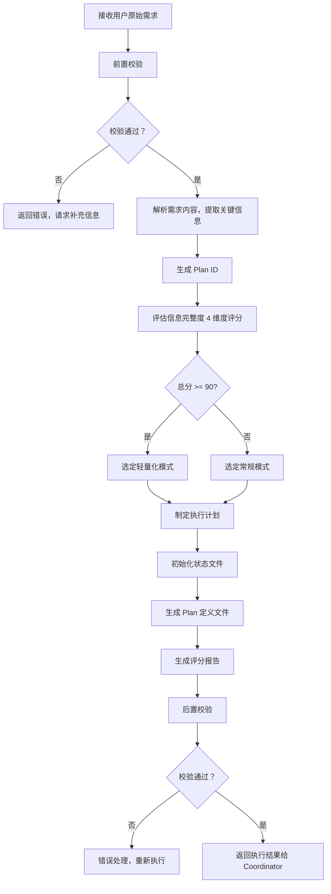

# Skill0: Plan 制定

## 元信息

| 项目 | 内容 |
|-----|------|
| **Skill 编号** | S0-S00 |
| **Skill 名称** | Plan 制定 |
| **Skill 英文名称** | Plan Definition |
| **所属阶段** | S0 - 初始化阶段 |
| **执行顺序** | 第 1 个执行（入口 Skill） |
| **执行模式** | 常规模式 / 轻量化模式均执行 |
| **执行 Agent** | Executor Agent |
| **依赖 Skill** | 无（入口 Skill） |
| **版本号** | 2.0（标准化版本） |

---

## 1. 功能描述

### 1.1 核心职责

Skill0 是整个需求分析流程的入口点，负责：

1. **解析用户原始需求**：理解用户输入的需求描述，提取关键信息
2. **生成 Plan ID**：为本次需求分析分配唯一标识符
3. **评估信息完整度**：对需求信息进行 4 维度评分，确定执行模式
4. **制定执行计划**：根据需求内容确定执行阶段和 Skill 序列
5. **初始化状态文件**：创建并初始化所有必要的状态文件
6. **输出 Plan 定义**：生成完整的执行计划和评分报告

### 1.2 输入规范

**输入来源**：用户通过 Coordinator Agent 提交

**输入内容**：
```json
{
  "originalRequirement": "用户原始需求文本（自然语言描述）",
  "supplementaryMaterials": [
    {
      "type": "link|document|image",
      "content": "补充材料内容",
      "description": "材料描述"
    }
  ]
}
```

**输入要求**：
- `originalRequirement`: 必填，至少 10 个字符
- `supplementaryMaterials`: 可选，支持竞品链接、参考文档等

### 1.3 输出规范

**输出产物**：

| 产物 ID | 产物类型 | 文件路径 | 说明 |
|---------|----------|----------|------|
| `{PlanID}-S0-S00-001-plan` | Plan 定义文件 | `database/plans/{PlanID}.json` | 完整的执行计划定义 |
| `{PlanID}-S0-S00-001-score` | 评分报告 | `database/stages/s0/{PlanID}-S0-S00-001-score.md` | 信息完整度评分报告 |
| `{PlanID}-S0-S00-001-status` | 状态文件 | `database/status.json` | 执行状态追踪 |
| `{PlanID}-S0-S00-001-resume` | 断点文件 | `database/resume.json` | 断点续跑配置 |

**输出格式**：
- Plan 定义文件：JSON 格式
- 评分报告：Markdown 格式
- 状态文件：JSON 格式
- 断点文件：JSON 格式

---

## 2. 执行流程

### 2.1 主流程



### 2.2 详细步骤说明

#### 步骤 1：前置校验

**校验内容**：
- 需求文本非空
- 需求文本长度 ≥ 10 字符
- 需求文本不包含敏感信息（如密码、密钥等）

**错误处理**：
- 为空：返回错误码 E001，提示"请提供需求描述"
- 过短：返回警告码 W001，建议"请补充更多细节"
- 敏感信息：返回警告码 W002，提醒"注意信息安全"

#### 步骤 2：需求解析

**解析内容**：
- 产品类型/领域
- 目标用户群体
- 核心功能点
- 使用场景
- 约束条件（时间、预算、技术等）
- 业务目标

**输出**：结构化的需求信息对象

#### 步骤 3：Plan ID 生成

**生成规则**：
1. 取当前时间戳后 6 位（毫秒级）
2. 格式：`P{6 位数字}`，如 `P000001`
3. 冲突检测：检查 `database/plans/` 目录
4. 如冲突，追加 1 位随机数，最多重试 3 次

**示例**：
```
时间戳：2026-03-24T10:30:45.123Z → 取 "451230" → P451230
```

#### 步骤 4：信息完整度评分

**评分维度**（满分 100 分）：

| 维度 | 分值 | 子维度 | 分值 | 检查要点 |
|------|------|--------|------|----------|
| **边界清晰度** | 25 分 | 产品目标 | 8 分 | 清晰描述产品要解决什么问题 |
| | | 目标受众 | 8 分 | 明确目标用户群体特征 |
| | | 核心场景 | 9 分 | 描述主要使用场景 |
| **需求具体度** | 25 分 | 显性功能 | 12 分 | 列出核心功能点 |
| | | 非功能需求 | 13 分 | 性能、安全、体验等要求 |
| **约束明确度** | 25 分 | 时间约束 | 6 分 | 交付时间要求 |
| | | 预算约束 | 6 分 | 预算范围 |
| | | 技术约束 | 7 分 | 技术栈限制 |
| | | 资源约束 | 6 分 | 团队规模/资源限制 |
| **目标明确度** | 25 分 | 核心价值 | 12 分 | 产品带来的核心价值 |
| | | 商业目标 | 13 分 | 商业目标和成功指标 |

**评分细则**：

**边界清晰度（25 分）**：
- 产品目标明确（8 分）：清晰描述产品要解决什么问题
- 目标受众明确（8 分）：明确目标用户群体特征
- 核心场景明确（9 分）：描述主要使用场景

**需求具体度（25 分）**：
- 显性功能明确（12 分）：列出核心功能点
- 非功能需求明确（13 分）：性能、安全、体验等要求

**约束明确度（25 分）**：
- 时间约束（6 分）：交付时间要求
- 预算约束（6 分）：预算范围
- 技术约束（7 分）：技术栈限制
- 资源约束（6 分）：团队规模/资源限制

**目标明确度（25 分）**：
- 核心价值明确（12 分）：产品带来的核心价值
- 商业目标明确（13 分）：商业目标和成功指标

**执行模式判定**：
- 总分 ≥ 90 分 → `lightweight` 模式
- 总分 < 90 分 → `normal` 模式

#### 步骤 5：执行计划制定

**阶段定义**：

| 阶段 | 阶段编号 | 包含 Skill | 说明 |
|------|----------|-----------|------|
| S0 | S0 | Skill0 | 初始化阶段（Plan 制定） |
| S1 | S1 | Skill1-4 | 需求边界与原始采集 |
| S2 | S2 | Skill9-10 | 市场与需求价值校验 |
| S3 | S3 | Skill7,11-12 | 技术可行性与选型 |
| S4 | S4 | Skill5-6,8 | 需求整合与核心提炼 |

**常规模式执行序列**：
```
S0 → S1(S01→S02→S03→S04) → S2(S09→S10) → S3(S07→S11→S12) → S4(S05→S06→S08)
```

**轻量化模式执行序列**：
```
S0 → S1(S01→S02→S04) → S3(S07→S11) → S4(S05→S08)
```

**轻量化模式跳过的 Skill**：
- Skill3 (S1-S03): 隐性需求挖掘
- Skill9 (S2-S09): 竞品分析
- Skill10 (S2-S10): 市场痛点验证
- Skill12 (S3-S12): 轻量化技术选型
- Skill6 (S4-S06): 需求优先级排序（简化执行）

#### 步骤 6：状态文件初始化

**status.json 初始化内容**：
```json
{
  "planId": "{生成的 Plan ID}",
  "version": "1.0",
  "createdAt": "{ISO 时间戳}",
  "executionMode": "normal|lightweight",
  "currentStage": "S0",
  "currentSkill": "S00",
  "overallStatus": "in_progress",
  "stages": {
    "S0": {"status": "completed", "skills": [{"skillId": "S00", "status": "completed"}]},
    "S1": {"status": "pending", "skills": [...]},
    "S2": {"status": "pending", "skills": [...]},
    "S3": {"status": "pending", "skills": [...]},
    "S4": {"status": "pending", "skills": [...]}
  },
  "metadata": {
    "informationScore": {
      "total": 85,
      "dimensions": {
        "boundary": 20,
        "requirement": 22,
        "constraint": 20,
        "goal": 23
      }
    },
    "originalRequirement": "{用户原始需求文本}"
  }
}
```

**resume.json 初始化内容**：
```json
{
  "planId": "{生成的 Plan ID}",
  "version": "1.0",
  "lastSavedAt": "{ISO 时间戳}",
  "executionContext": {
    "currentStage": "S0",
    "currentSkill": "S00",
    "nextStage": "S1",
    "nextSkill": "S01",
    "executionMode": "normal|lightweight"
  },
  "pendingActions": [],
  "checkpoint": {
    "stage": "S0",
    "skill": "S00",
    "status": "completed",
    "canResume": true
  }
}
```

#### 步骤 7：后置校验

**校验内容**：
- Plan 定义文件已生成且格式正确
- 评分报告已生成且内容完整
- 状态文件已初始化
- 断点文件已初始化
- 所有必填字段已填充

**错误处理**：
- 文件不存在：返回错误码 E201，重新执行产物生成
- JSON 格式错误：返回错误码 E202，重新生成产物文件
- 必填字段缺失：返回错误码 E203，补充缺失字段后重新生成

### 2.3 错误处理

#### 前置校验错误

| 错误类型 | 错误码 | 处理策略 | 用户提示 |
|----------|--------|----------|----------|
| 需求文本为空 | E001 | 返回错误，要求用户提供需求描述 | "请提供需求描述" |
| 需求文本过短（<10 字） | W002 | 返回警告，建议补充更多细节 | "建议补充更多细节，至少 10 个字符" |
| 需求文本包含敏感信息 | W003 | 返回警告，提醒用户注意信息安全 | "检测到敏感信息，请注意信息安全" |

#### 执行过程错误

| 错误类型 | 错误码 | 处理策略 | 重试次数 |
|----------|--------|----------|----------|
| Plan ID 生成冲突 | E101 | 重新生成，追加随机数 | 最多 3 次 |
| 文件写入失败 | E102 | 记录错误日志，返回失败状态 | 不重试 |
| JSON 序列化失败 | E103 | 检查数据结构，返回失败状态 | 不重试 |

#### 后置校验错误

| 错误类型 | 错误码 | 处理策略 | 重试次数 |
|----------|--------|----------|----------|
| 产物文件不存在 | E201 | 重新执行产物生成 | 1 次 |
| 产物 JSON 格式错误 | E202 | 重新生成产物文件 | 1 次 |
| 必填字段缺失 | E203 | 补充缺失字段，重新生成 | 1 次 |

---

## 3. 依赖关系

### 3.1 前置 Skill

**无** - Skill0 是入口 Skill，无前置依赖

### 3.2 后置 Skill

**常规模式**：
- Skill1 (S1-S01): 需求边界界定 - 依赖 Skill0 生成的 Plan ID 和状态文件

**轻量化模式**：
- Skill1 (S1-S01): 需求边界界定 - 依赖 Skill0 生成的 Plan ID 和状态文件

### 3.3 依赖的产物 ID

**无** - Skill0 不依赖其他 Skill 的产物

### 3.4 被依赖的产物 ID

**Skill0 生成的产物被后续 Skill 依赖**：

| 产物 ID | 产物类型 | 被依赖的 Skill | 用途 |
|---------|----------|----------------|------|
| `{PlanID}-S0-S00-001-plan` | Plan 定义文件 | 所有后续 Skill | 获取执行计划和阶段信息 |
| `{PlanID}-S0-S00-001-status` | 状态文件 | 所有后续 Skill | 追踪执行状态 |
| `{PlanID}-S0-S00-001-resume` | 断点文件 | 所有后续 Skill | 支持断点续跑 |

---

## 4. 质量标准

### 4.1 输出质量检查清单

**Plan 定义文件检查**：
- [ ] Plan ID 格式正确（P+6 位数字）
- [ ] 执行模式正确（normal 或 lightweight）
- [ ] 阶段定义完整（S0-S4）
- [ ] Skill 序列正确（根据执行模式）
- [ ] 信息完整度评分数据完整
- [ ] 原始需求文本已保留
- [ ] JSON 格式有效

**评分报告检查**：
- [ ] 4 个维度评分完整
- [ ] 各子维度得分合理（0-满分）
- [ ] 总分计算正确
- [ ] 执行模式判定正确（≥90 分为 lightweight）
- [ ] 执行计划与模式匹配
- [ ] Markdown 格式规范

**状态文件检查**：
- [ ] Plan ID 与生成的一致
- [ ] 当前阶段为 S0
- [ ] 当前 Skill 为 S00
- [ ] S0 状态为 completed
- [ ] 后续阶段状态为 pending
- [ ] JSON 格式有效

**断点文件检查**：
- [ ] Plan ID 与生成的一致
- [ ] 下一阶段为 S1
- [ ] 下一 Skill 为 S01
- [ ] 断点状态为可恢复
- [ ] JSON 格式有效

### 4.2 验收标准

**功能性验收**：
- [ ] 能正确解析用户输入的需求文本
- [ ] 能生成唯一的 Plan ID
- [ ] 能正确评估信息完整度（4 维度评分）
- [ ] 能根据评分正确选定执行模式
- [ ] 能生成完整的执行计划
- [ ] 能正确初始化状态文件和断点文件

**性能验收**：
- [ ] 执行耗时 < 3 秒
- [ ] 产物文件大小合理（Plan 定义 < 10KB）
- [ ] 无内存泄漏

**质量验收**：
- [ ] 产物通过率 100%（Validator 校验）
- [ ] 无格式错误
- [ ] 无必填字段缺失
- [ ] 数据一致性强

---

## 5. 产物规范

### 5.1 产物 ID 格式

**标准格式**：`{PlanID}-{Stage}-{SkillID}-{序号}-{类型}`

**Skill0 产物 ID 示例**：
- `P000001-S0-S00-001-plan` - Plan 定义文件
- `P000001-S0-S00-001-score` - 评分报告
- `P000001-S0-S00-001-status` - 状态文件
- `P000001-S0-S00-001-resume` - 断点文件

### 5.2 存储路径规范

**目录结构**：
```
database/
├── plans/
│   └── {PlanID}.json
├── stages/
│   └── s0/
│       └── {PlanID}-S0-S00-001-score.md
├── status.json
└── resume.json
```

**路径规则**：
- Plan 定义文件：`database/plans/{PlanID}.json`
- 评分报告：`database/stages/s0/{PlanID}-S0-S00-001-score.md`
- 状态文件：`database/status.json`
- 断点文件：`database/resume.json`

### 5.3 模板引用

**评分报告模板**：
- 模板文件：`skills/skill0-plan/template.md`
- 模板版本：2.0（标准化版本）
- 引用方式：直接引用模板结构，填充实际数据

### 5.4 产物示例

**Plan 定义文件示例**：
```json
{
  "planId": "P000001",
  "version": "1.0",
  "createdAt": "2026-03-24T10:30:45.123Z",
  "executionMode": "normal",
  "stages": [
    {
      "stageId": "S0",
      "stageName": "初始化阶段",
      "status": "completed",
      "skills": [
        {"skillId": "S00", "skillName": "Plan 制定", "status": "completed"}
      ]
    },
    {
      "stageId": "S1",
      "stageName": "需求边界与原始采集",
      "status": "pending",
      "skills": [
        {"skillId": "S01", "skillName": "需求边界界定", "status": "pending"},
        {"skillId": "S02", "skillName": "显性需求提取", "status": "pending"},
        {"skillId": "S03", "skillName": "隐性需求挖掘", "status": "pending"},
        {"skillId": "S04", "skillName": "需求验证", "status": "pending"}
      ]
    },
    {
      "stageId": "S2",
      "stageName": "市场与需求价值校验",
      "status": "pending",
      "skills": [
        {"skillId": "S09", "skillName": "竞品分析", "status": "pending"},
        {"skillId": "S10", "skillName": "市场痛点验证", "status": "pending"}
      ]
    },
    {
      "stageId": "S3",
      "stageName": "技术可行性与选型",
      "status": "pending",
      "skills": [
        {"skillId": "S07", "skillName": "需求风险识别", "status": "pending"},
        {"skillId": "S11", "skillName": "技术可行性评估", "status": "pending"},
        {"skillId": "S12", "skillName": "轻量化技术选型", "status": "pending"}
      ]
    },
    {
      "stageId": "S4",
      "stageName": "需求整合与核心提炼",
      "status": "pending",
      "skills": [
        {"skillId": "S05", "skillName": "需求分类梳理", "status": "pending"},
        {"skillId": "S06", "skillName": "需求优先级排序", "status": "pending"},
        {"skillId": "S08", "skillName": "核心需求提炼", "status": "pending"}
      ]
    }
  ],
  "informationScore": {
    "total": 85,
    "dimensions": {
      "boundary": 20,
      "requirement": 22,
      "constraint": 20,
      "goal": 23
    },
    "executionMode": "normal"
  },
  "originalRequirement": "用户原始需求文本"
}
```

---

## 6. 版本历史

| 版本 | 日期 | 更新内容 | 变更类型 |
|------|------|----------|----------|
| 1.0 | 2026-03-24 | 初始版本，定义 Skill0 完整规范 | 新增 |
| 2.0 | 2026-03-24 | 标准化优化：统一 6 段式结构、标准化产物 ID 格式、完善质量标准 | 优化 |

---

## 附录 A：执行示例

### 示例 1：完整需求输入

**输入**：
```
我想开发一个面向大学生的时间管理 APP，帮助用户管理学习计划和任务。
核心功能包括：任务创建、日程安排、番茄钟、学习统计。
目标用户是 18-25 岁的大学生，主要在校园场景使用。
要求 3 个月内完成 MVP，预算 10 万以内，使用 Flutter 开发。
目标是提高学生学习效率，预期日活用户达到 1000 人。
```

**评分结果**：
- 边界清晰度：23/25（产品目标、受众、场景都较明确）
- 需求具体度：24/25（功能点清晰，但非功能需求可补充）
- 约束明确度：25/25（时间、预算、技术、资源都明确）
- 目标明确度：23/25（核心价值和商业目标明确）
- **总分：95 分 → lightweight 模式**

**生成的 Plan ID**：`P000001`

**执行序列**：
```
S0 → S1(S01→S02→S04) → S3(S07→S11) → S4(S05→S08)
```

### 示例 2：简略需求输入

**输入**：
```
我想做一个时间管理 APP。
```

**评分结果**：
- 边界清晰度：12/25（仅知道产品类型）
- 需求具体度：5/25（无具体功能描述）
- 约束明确度：3/25（无约束信息）
- 目标明确度：5/25（无明确目标）
- **总分：25 分 → normal 模式**

**生成的 Plan ID**：`P000002`

**执行序列**：
```
S0 → S1(S01→S02→S03→S04) → S2(S09→S10) → S3(S07→S11→S12) → S4(S05→S06→S08)
```

---

## 附录 B：协作接口

### 与 Coordinator Agent 的协作

**调用方式**：Coordinator 通过 Executor Agent 调用 Skill0

**输入参数**：
```json
{
  "action": "execute_skill",
  "skillId": "S00",
  "input": {
    "originalRequirement": "用户原始需求文本",
    "supplementaryMaterials": []
  }
}
```

**输出结果**：
```json
{
  "status": "success|failed",
  "planId": "P000001",
  "executionMode": "normal|lightweight",
  "outputs": [
    {
      "artifactId": "P000001-S0-S00-001-plan",
      "artifactType": "plan_definition",
      "filePath": "database/plans/P000001.json"
    },
    {
      "artifactId": "P000001-S0-S00-001-score",
      "artifactType": "score_report",
      "filePath": "database/stages/s0/P000001-S0-S00-001-score.md"
    },
    {
      "artifactId": "P000001-S0-S00-001-status",
      "artifactType": "status_file",
      "filePath": "database/status.json"
    },
    {
      "artifactId": "P000001-S0-S00-001-resume",
      "artifactType": "resume_file",
      "filePath": "database/resume.json"
    }
  ],
  "nextStage": "S1",
  "nextSkill": "S01"
}
```

### 与 Validator Agent 的协作

**前置校验**：Validator 检查输入数据完整性
**后置校验**：Validator 检查产物文件格式和内容

### 与 UserInteraction Agent 的协作

**交互场景**：
- 当需求信息不完整时，触发用户交互请求补充信息
- 当评分结果处于临界值（85-95 分）时，询问用户是否采用轻量化模式

---

*本 Skill 符合 IEEE 29148-2011 需求和软件工程标准，遵循 SMART 原则*
