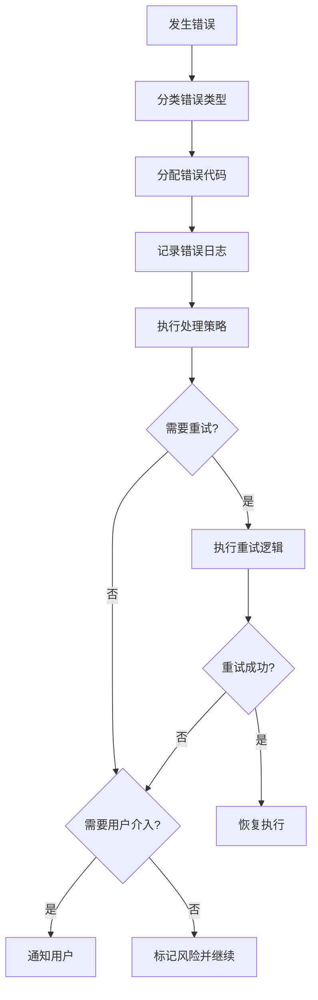

# 错误代码标准规范

## 概述

本文档定义SWF项目所有Skill的统一错误代码体系，确保错误处理的一致性和可维护性。

---

## 错误代码分类体系

### 代码范围分配

| 代码范围 | 分类 | 说明 |
|----------|------|------|
| E001-E099 | 前置校验错误 | 执行前检查发现的错误 |
| E100-E199 | 执行过程错误 | Skill执行过程中发生的错误 |
| E200-E299 | 后置校验错误 | 执行后验证发现的错误 |
| E300-E399 | 用户评审错误 | 用户评审阶段发生的错误 |
| E400-E499 | 用户交互错误 | 用户交互过程中发生的错误 |
| E900-E999 | 系统错误 | 系统级错误和未分类错误 |
| W001-W099 | 前置警告 | 非致命的前置检查警告 |
| W100-W199 | 执行警告 | 非致命的执行过程警告 |
| W200-W299 | 后置警告 | 非致命的后置检查警告 |
| W300-W399 | 评审警告 | 评审超时等警告 |
| W400-W499 | 交互警告 | 交互超时等警告 |

---

## 标准错误代码定义

### 前置校验错误 (E001-E099)

| 代码 | 错误名称 | 说明 | 处理策略 |
|------|----------|------|----------|
| E001 | 输入文件不存在 | 依赖的产物文件不存在 | 返回错误，提示先执行前置Skill |
| E002 | 输入数据缺失 | 必需的输入数据为空 | 返回错误，提示补充数据 |
| E003 | 输入格式错误 | 输入数据格式不符合要求 | 返回错误，提示格式要求 |
| E004 | 产物ID格式错误 | 产物ID不符合规范 | 返回错误，提示正确格式 |
| E005 | 依赖Skill未执行 | 前置Skill任务状态未完成 | 返回错误，提示先完成前置Skill |

### 执行过程错误 (E100-E199)

| 代码 | 错误名称 | 说明 | 处理策略 |
|------|----------|------|----------|
| E101 | 数据解析失败 | 无法解析输入数据 | 重试3次，失败则返回错误 |
| E102 | 处理逻辑异常 | 执行过程中发生异常 | 记录日志，返回错误 |
| E103 | 外部服务错误 | 调用外部服务失败 | 重试3次，失败则标记风险 |
| E104 | 数据一致性错误 | 数据校验失败 | 返回错误，提示数据问题 |

### 后置校验错误 (E200-E299)

| 代码 | 错误名称 | 说明 | 处理策略 |
|------|----------|------|----------|
| E201 | 产物文件不存在 | 产物生成失败 | 重新执行生成逻辑 |
| E202 | 产物格式错误 | 产物格式不符合规范 | 重新生成产物 |
| E203 | 必填字段缺失 | 产物中关键字段为空 | 补充字段后重新生成 |
| E204 | 产物ID冲突 | 产物ID与已有产物冲突 | 重新生成ID |

### 用户评审错误 (E300-E399)

| 代码 | 错误名称 | 说明 | 处理策略 |
|------|----------|------|----------|
| E301 | 评审未通过 | 用户提出修改意见 | 根据意见修改产物 |
| E302 | 评审意见解析失败 | 无法理解用户输入 | 重新请求输入，最多3次 |
| E303 | 评审超时 | 用户24小时未响应 | 保持paused状态，等待用户 |

### 用户交互错误 (E400-E499)

| 代码 | 错误名称 | 说明 | 处理策略 |
|------|----------|------|----------|
| E401 | 用户输入无效 | 输入不符合预期格式 | 重新提问，引导正确输入 |
| E402 | 多轮交互超限 | 超过3轮交互仍未明确 | 记录信息缺失，标记风险 |
| E403 | 用户拒绝回答 | 用户明确表示不回答 | 使用默认值，标记风险 |

### 系统错误 (E900-E999)

| 代码 | 错误名称 | 说明 | 处理策略 |
|------|----------|------|----------|
| E901 | 文件系统错误 | 文件读写失败 | 检查权限，重试3次 |
| E902 | 内存不足 | 系统资源不足 | 提示用户，中止执行 |
| E999 | 未知错误 | 未分类的错误 | 记录日志，返回错误 |

### 警告代码 (W系列)

| 代码 | 警告名称 | 说明 | 处理策略 |
|------|----------|------|----------|
| W001 | 输入数据不完整 | 部分可选数据缺失 | 继续执行，标记待补充 |
| W101 | 处理时间较长 | 执行时间超过预期 | 继续执行，记录日志 |
| W301 | 评审等待超时 | 用户未及时评审 | 发送提醒，保持等待 |
| W401 | 交互响应超时 | 用户未及时响应 | 使用默认值继续 |

---

## Skill特定错误代码

各Skill可以在标准错误代码基础上，定义特定错误代码：

### S001 - Plan制定

| 代码 | 错误名称 | 说明 |
|------|----------|------|
| E011 | PlanID生成冲突 | 生成的ID已存在 |
| E012 | 评分计算错误 | 完整度评分计算异常 |

### S101-S104 - S1阶段

| 代码 | 错误名称 | 说明 |
|------|----------|------|
| E111 | 需求边界不清晰 | 无法明确界定边界 |
| E112 | 需求提取失败 | 无法从输入中提取需求 |
| E113 | 需求验证冲突 | 验证发现需求矛盾 |

### S201-S202 - S2阶段

| 代码 | 错误名称 | 说明 |
|------|----------|------|
| E121 | 竞品信息获取失败 | 无法获取竞品数据 |
| E122 | 市场数据不足 | 市场验证数据不充分 |

### S301-S303 - S3阶段

| 代码 | 错误名称 | 说明 |
|------|----------|------|
| E131 | 风险评估失败 | 无法完成风险评估 |
| E132 | 技术可行性判定失败 | 可行性评估异常 |
| E133 | 技术选型冲突 | 选型结果存在冲突 |

### S401-S404 - S4阶段

| 代码 | 错误名称 | 说明 |
|------|----------|------|
| E141 | 需求分类失败 | 无法完成需求分类 |
| E142 | 优先级排序失败 | 排序算法异常 |
| E143 | 核心需求提取失败 | 无法提取核心需求 |
| E144 | 原型设计失败 | 原型生成异常 |

---

## 使用规范

### 1. 错误代码分配原则

1. **优先使用标准代码**：尽量使用本文档定义的标准错误代码
2. **Skill特定代码**：仅在标准代码无法满足时使用Skill特定代码
3. **代码唯一性**：确保同一Skill内错误代码不重复
4. **文档同步**：添加新错误代码时同步更新本文档

### 2. 错误处理流程



### 3. 错误信息格式

```markdown
**错误代码**: E301
**错误类型**: 用户评审错误
**错误描述**: 用户提出修改意见
**处理建议**: 根据用户意见修改产物后重新提交评审
**重试次数**: 最多3次
```

---

## 版本历史

| 版本 | 日期 | 变更内容 |
|------|------|----------|
| v1.0 | 2026-03-27 | 初始版本，统一14个Skill的错误代码体系 |

---

**文档版本**: v1.0
**适用范围**: 所有14个Skill（S001, S101-S104, S201-S202, S301-S303, S401-S404）
**最后更新**: 2026-03-27
