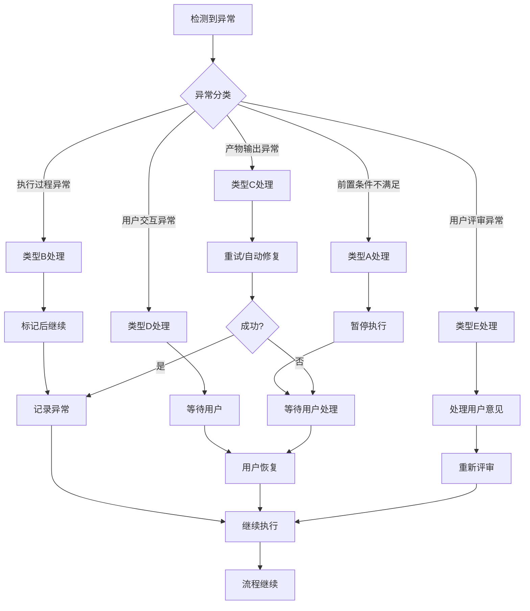

# 异常场景处理指南（工作流版）

## 设计理念

- **自然语言**：使用场景描述替代错误代码
- **用户友好**：提示信息易于非技术人员理解
- **行动导向**：明确告诉用户该做什么
- **工作流视角**：关注流程中断和恢复，而非技术错误

---

## 异常分类框架

### 类型A：前置条件不满足

当发现依赖的产物不存在或信息不完整时触发。

| 场景 | 触发条件 | 系统行为 | 用户提示 |
|------|----------|----------|----------|
| **前置产物缺失** | 依赖的Skill产物文件不存在 | 暂停当前执行，等待用户处理 | "【暂停】需要先完成【SkillX-名称】的分析。请确认 `database/{PlanID}/XX-xxx.md` 文件是否存在。如不存在，请先执行前置Skill。" |
| **输入信息不完整** | 关键字段为空或描述模糊 | 触发信息补全交互 | "【信息补充】为了继续分析，需要补充以下信息：{字段名称}。这会影响{具体影响}。请提供：" |
| **产物格式不符** | 前置产物结构不符合预期模板 | 提示检查或重新生成 | "【格式检查】前置产物格式异常。建议：1) 检查文件内容是否完整；2) 或重新执行【SkillX】生成规范产物。" |
| **前置任务未完成** | Todo-List中前置任务状态非"已完成" | 暂停并提示完成前置任务 | "【任务依赖】前置任务【SkillX】尚未完成（当前状态：{状态}）。请先完成该任务。" |

---

### 类型B：执行过程异常

当AI在执行分析过程中遇到不确定性或冲突时触发。

| 场景 | 触发条件 | 系统行为 | 用户提示 |
|------|----------|----------|----------|
| **分析依据不足** | AI无法基于现有信息推导有效结论 | 标记为"待确认"，继续执行并在产物中标注 | "【低置信度】部分分析内容推导依据不足，已在产物中标记为"待确认"。建议后续补充更多信息验证。" |
| **需求冲突** | 发现需求间存在矛盾或不可兼得 | 暂停执行，请求用户决策 | "【需求冲突】发现以下冲突：{冲突描述A} vs {冲突描述B}。请确认优先满足哪个？" |
| **信息获取受限** | 无法获取竞品/市场等外部信息 | 基于已有信息继续，标注不确定性 | "【信息受限】部分外部信息获取受限（如{具体信息}），分析结论可能存在偏差，已在产物中标注。" |
| **分析结果不确定** | 多个分析方向置信度相近 | 列出备选方案，请求用户选择 | "【多方案】基于当前信息，存在以下可行方案：\nA. {方案A}\nB. {方案B}\n请选择或提供更多信息。" |

---

### 类型C：产物输出异常

当生成或保存产物时出现问题时触发。

| 场景 | 触发条件 | 系统行为 | 用户提示 |
|------|----------|----------|----------|
| **产物保存失败** | 无法写入文件（权限/磁盘等） | 重试3次后提示用户检查 | "【保存失败】无法保存产物文件。请检查：1) 目录写入权限；2) 磁盘空间。修复后输入"继续"重试。" |
| **产物内容不完整** | 必填字段缺失或为空 | 自动补充或提示完善 | "【内容完善】产物缺少以下必填内容：{字段列表}。正在自动补充，或您可以手动提供。" |
| **格式不符合模板** | 输出结构与标准模板差异较大 | 自动调整格式 | "【格式调整】产物格式已自动调整为标准模板格式。如有特殊需求请告知。" |
| **产物ID冲突** | 生成的产物ID已存在 | 重新生成唯一ID | "【ID调整】产物ID已自动调整为{新ID}以避免冲突。" |

---

### 类型D：用户交互异常

当与用户的交互过程中出现中断或理解偏差时触发。

| 场景 | 触发条件 | 系统行为 | 用户提示 |
|------|----------|----------|----------|
| **用户长时间未响应** | 超过设定等待时间（如10分钟） | 保存状态，暂停工作流 | "【已暂停】等待用户输入超时。当前进度已保存。随时输入"继续"可恢复执行。" |
| **用户输入无法解析** | 输入格式不符合预期 | 提示正确格式，请求重新输入 | "【输入格式】无法理解的输入格式。请参考以下格式：\n{格式示例}\n请重新输入：" |
| **多轮交互未明确** | 超过最大交互轮次（如3轮）仍未明确 | 标记为"待确认"，继续执行 | "【待确认】该信息暂未完全明确，已标记为"待确认"继续执行。后续可在产物中补充。" |
| **用户主动中断** | 用户输入"暂停"/"停止"等 | 保存状态，优雅退出 | "【已暂停】工作流已暂停，当前状态已保存。输入"继续"可从断点恢复。" |

---

### 类型E：用户评审异常

当用户评审产物时出现分歧或超时等情况时触发。

| 场景 | 触发条件 | 系统行为 | 用户提示 |
|------|----------|----------|----------|
| **用户要求修改** | 评审时提出修改意见 | 根据意见调整产物，重新展示 | "【修改中】正在根据您的意见调整：{修改内容}。调整完成后将重新展示。" |
| **用户评审超时** | 超过评审等待时间（如24小时） | 状态设为"待评审"，等待恢复 | "【评审超时】等待评审超时，状态设为"待评审"。随时可输入"继续评审"恢复。" |
| **用户新增需求** | 评审时提出新的需求或想法 | 评估影响范围，决定是否纳入 | "【新需求】收到新需求：{需求简述}。评估影响：{影响范围}。是否纳入当前分析？" |
| **用户要求重做** | 对产物不满意要求重新执行 | 返回Skill起点重新执行 | "【重新执行】将重新执行【SkillX】，之前产物将保留为历史版本。" |

---

## 异常处理流程图



---

## 异常记录格式

在产物中记录异常信息：

```markdown
## 异常记录

| 序号 | 异常类型 | 场景 | 发生时间 | 处理方式 | 状态 |
|------|----------|------|----------|----------|------|
| 1 | 前置条件 | 前置产物缺失 | 2026-03-27 10:30 | 暂停等待用户 | 已解决 |
| 2 | 执行过程 | 分析依据不足 | 2026-03-27 11:00 | 标记待确认 | 待确认 |

## 异常详情

### 异常1：前置产物缺失
- **触发Skill**：Skill2-显性需求提取
- **缺失产物**：01-boundary.md（Skill1产物）
- **用户处理**：用户补充执行Skill1
- **解决时间**：2026-03-27 10:45

### 异常2：分析依据不足
- **触发Skill**：Skill3-隐性需求挖掘
- **具体内容**：场景延伸分析中"通勤场景"推导依据不足
- **当前处理**：已标记为"待确认"，继续执行
- **后续建议**：补充用户调研数据验证
```

---

## 用户提示语设计原则

### 1. 结构清晰
```
【状态标签】核心信息
详细说明...
建议操作...
```

### 2. 行动明确
- ❌ "出错了"
- ✅ "【暂停】需要先完成XX，请执行XX后输入'继续'"

### 3. 提供选项
```
请选择：
A. 选项A（说明）
B. 选项B（说明）
C. 其他（请说明）
```

### 4. 保持上下文
```
【暂停】当前执行：Skill2-显性需求提取
【原因】前置产物缺失：01-boundary.md
【建议】请先完成Skill1，然后输入"继续"
```

---

## 与旧错误代码对照

| 旧错误代码 | 旧描述 | 新场景分类 | 新提示示例 |
|------------|--------|------------|------------|
| E001 | 前置产物缺失 | 类型A-前置产物缺失 | "【暂停】需要先完成【SkillX】..." |
| E101 | Plan ID生成冲突 | 类型C-产物ID冲突 | "【ID调整】产物ID已自动调整..." |
| E201 | 产物文件不存在 | 类型C-产物保存失败 | "【保存失败】无法保存产物文件..." |
| E301 | 用户评审未通过 | 类型E-用户要求修改 | "【修改中】正在根据您的意见调整..." |
| W401 | 用户交互超时 | 类型D-用户长时间未响应 | "【已暂停】等待用户输入超时..." |

---

## 使用建议

1. **优先使用自然语言**：避免展示错误代码给用户
2. **保持积极语气**：即使是暂停，也强调"已保存，可随时恢复"
3. **提供明确下一步**：告诉用户具体该做什么
4. **记录完整上下文**：便于断点续跑时恢复状态

---

*异常处理指南 v1.0*
*替代原"错误代码表"，适用于工作流场景*
