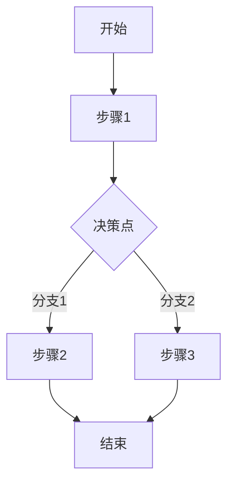
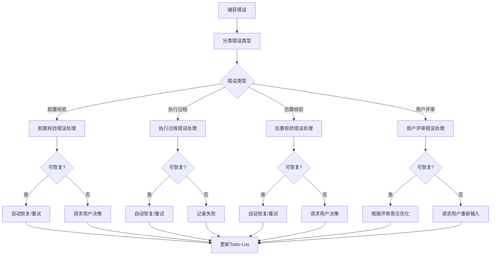

# Skill 6段式结构参考文档

本文档基于S001（Plan制定）的最终结构，为后续13个Skill优化提供参照模板。

---

## 文档结构总览

每个Skill必须包含以下6个Section：

```markdown
# {Skill编号}: {Skill名称}

## Section 1: 元信息 (Meta Information)
## Section 2: 功能描述 (Functional Description)
## Section 3: 执行流程 (Execution Process)
## Section 4: 产物规范 (Artifact Specifications)
## Section 5: 质量标准 (Quality Standards)
## Section 6: 错误处理 (Error Handling)
```

---

## Section 1: 元信息 (Meta Information)

### 必须包含的字段

| 字段 | 说明 | 示例 |
|------|------|------|
| **Skill 编号** | 新编号格式 | S001, S101, S201 |
| **Skill 名称** | 中文名称 | Plan 制定, 需求边界 |
| **Skill 英文名称** | 英文名称 | Plan Definition |
| **所属阶段** | 阶段编号和名称 | S0 - 初始化阶段 |
| **执行顺序** | 在整体流程中的位置 | 第 1 个执行（入口 Skill） |
| **执行模式** | 适用的执行模式 | 常规模式 / 轻量化模式均执行 |
| **依赖 Skill** | 前置Skill（无则填"无"） | S001 |
| **后置 Skill** | 后续Skill（多个用逗号分隔） | S101 |
| **版本** | 当前版本号 | v3.0 |
| **最后更新时间** | 更新日期 | 2026-03-27 |

### 元信息表格模板

```markdown
## Section 1: 元信息 (Meta Information)

| 项目             | 内容                       |
| -------------- | -------------------------- |
| **Skill 编号**   | {S001}                     |
| **Skill 名称**   | {Skill名称}                 |
| **Skill 英文名称** | {English Name}             |
| **所属阶段**       | {S0 - 阶段名称}              |
| **执行顺序**       | {第 X 个执行}                |
| **执行模式**       | {常规模式 / 轻量化模式}        |
| **依赖 Skill**   | {无 或 Sxxx}                |
| **后置 Skill**   | {Sxxx}                     |
| **版本**          | v3.0                       |
| **最后更新时间**    | 2026-03-27                 |
```

---

## Section 2: 功能描述 (Functional Description)

### 2.1 核心职责

- 列出3-8条核心职责
- 使用动词开头（解析、生成、评估、制定等）

```markdown
### 2.1 核心职责

{S001} 负责：

1. **职责1**：具体说明
2. **职责2**：具体说明
3. **职责3**：具体说明
...
```

### 2.2 输入规范 (Input Specifications)

包含：
- 用户需要提供什么（表格：内容、要求、示例）
- 输入验证规则（表格：规则、验证内容、错误码）
- 输入示例（2-3个典型场景）

### 2.3 输出规范 (Output Specifications)

包含：
- 产物清单（表格：产物名称、文件位置、格式、用途、用户可见性）
- 输出示例（核心产物的结构示例）

---

## Section 3: 执行流程 (Execution Process)

### 3.1 流程概览

- Mermaid流程图
- 展示主要步骤和决策点

```markdown
### 3.1 流程概览


```

### 3.2 详细步骤说明

每个步骤包含：
- 步骤目标
- 操作说明
- 验证规则
- 错误处理

```markdown
### 3.2 详细步骤说明

#### 步骤 1：{步骤名称}

**目标**：{该步骤要达成什么}

**操作**：
1. 操作1
2. 操作2

**验证规则**：
- 规则1
- 规则2

**错误处理**：
- 错误码：处理方式
```

### 3.3 Demo示例

必须包含2-3个完整示例：
- 输入示例
- 处理过程（关键步骤）
- 输出示例

```markdown
### 3.3 Demo示例

#### Demo 1：{场景描述}

**输入示例**：
```
{用户输入}
```

**处理过程**：
1. 步骤1 → 结果
2. 步骤2 → 结果
...

**输出示例**：
- 产物1: {内容}
- 产物2: {内容}
```

---

## Section 4: 产物规范 (Artifact Specifications)

### 4.1 产物 ID 命名规则

统一格式：
```
{PlanID}-S{阶段}-{SkillID}-{序号}
```

示例：
- `P000001-S0-S001-001` - 主产物
- `P000001-S0-S001-001-{后缀}` - 附属产物

### 4.2 存储路径结构

```markdown
### 4.2 存储路径结构

**目录结构**：
```
artifacts/
├── plans/
│   ├── index.md                       # Plan 列表索引（可选）
│   ├── {PlanID}.md                    # Plan 定义文件
│   └── {PlanID}/
│       └── todo-list.md               # Todo-List
└── stages/
    └── {s0-s4}/
        └── {PlanID}-S{阶段}-{SkillID}-{序号}.md
```

**路径规则**：
- 主产物：`artifacts/stages/{s0-s4}/{PlanID}-S{阶段}-{SkillID}-{序号}.md`
- 其他产物：根据类型存放
```

### 4.3 产物版本管理

```markdown
### 4.3 产物版本管理

**版本规则**：
- 初始版本：v1.0
- 小修改：v1.1, v1.2...
- 大修改：v2.0, v3.0...

**版本记录**：
在产物文件头部添加：
```markdown
---
version: v1.0
created_at: 2026-03-27 10:00:00
updated_at: 2026-03-27 10:00:00
---
```
```

---

## Section 5: 质量标准 (Quality Standards)

### 5.1 质量评估框架

统一使用ISO/IEC 25010五维度模型：

```markdown
### 5.1 质量评估框架

{Sxxx} 遵循 ISO/IEC 25010 质量评估框架：

| 维度 | 权重 | 评估标准 | 验收阈值 |
|------|------|----------|----------|
| **完整性** | 30% | 所有必需内容都已生成 | ≥ 90% |
| **准确性** | 25% | 内容准确，无错误 | ≥ 90% |
| **一致性** | 20% | 格式统一，术语一致 | ≥ 95% |
| **可读性** | 15% | 结构清晰，表达准确 | ≥ 85% |
| **可追溯性** | 10% | 来源清晰，关系明确 | ≥ 90% |

**质量综合得分** = 完整性×30% + 准确性×25% + 一致性×20% + 可读性×15% + 可追溯性×10%

**验收门槛**：质量综合得分 ≥ 85%
```

### 5.2 检查清单

根据Skill特点定制检查项：

```markdown
### 5.2 检查清单

**完整性检查**（30%）：
- [ ] 检查项1
- [ ] 检查项2
...

**准确性检查**（25%）：
- [ ] 检查项1
- [ ] 检查项2
...

**一致性检查**（20%）：
- [ ] 检查项1
- [ ] 检查项2
...

**可读性检查**（15%）：
- [ ] 检查项1
- [ ] 检查项2
...

**可追溯性检查**（10%）：
- [ ] 检查项1
- [ ] 检查项2
...
```

### 5.3 质量综合得分计算

```markdown
### 5.3 质量综合得分计算

```
得分 = Σ(维度得分 × 维度权重)

示例：
- 完整性：95% × 30% = 28.5
- 准确性：90% × 25% = 22.5
- 一致性：100% × 20% = 20.0
- 可读性：90% × 15% = 13.5
- 可追溯性：95% × 10% = 9.5
- 总分：28.5 + 22.5 + 20.0 + 13.5 + 9.5 = 94.0%
```
```

### 5.4 验收标准

```markdown
### 5.4 验收标准

| 结果 | 标准 | 处理方式 |
|------|------|----------|
| **通过** | 质量综合得分 ≥ 85% | 进入用户评审阶段 |
| **不通过** | 质量综合得分 < 85% | 识别问题 → 生成问题清单 → 自动重新执行 |
```

### 5.5 不达标处理流程

```markdown
### 5.5 不达标处理流程

```mermaid
flowchart TD
    Evaluate[质量评估] --> Score{得分 >= 85%?}
    Score -->|是| Pass[通过验收]
    Score -->|否| Identify[识别问题点]
    Identify --> List[生成问题清单]
    List --> ReExecute[自动重新执行{Sxxx}]
    ReExecute --> Retry{重试次数 < 3?}
    Retry -->|是| Evaluate
    Retry -->|否| Risk[标记为风险]
    Pass --> UserReview[进入用户评审]
    Risk --> UserReview
```

**重试机制**：
- 第1次：自动重新执行，尝试修复问题
- 第2次：自动重新执行，调整参数
- 第3次：自动重新执行，简化复杂部分
- 仍不达标：标记为风险，进入用户评审并提示问题
```

---

## Section 6: 错误处理 (Error Handling)

### 6.1 错误分类与代码表

错误码范围规划：
- E001-E099：前置校验错误
- E100-E199：执行过程错误
- E200-E299：后置校验错误
- E300-E399：用户评审错误
- E400-E499：用户交互错误

```markdown
### 6.1 错误分类与代码表

**前置校验错误**（E001-E099）：

| 错误码 | 错误类型 | 说明 | 处理策略 |
|--------|----------|------|----------|
| E001 | 错误类型1 | 说明 | 处理策略 |
| E002 | 错误类型2 | 说明 | 处理策略 |

**执行过程错误**（E100-E199）：
...

**后置校验错误**（E200-E299）：
...

**用户评审错误**（E300-E399）：
...
```

### 6.2 错误处理流程图

```markdown
### 6.2 错误处理流程图


```

### 6.3 用户交互协议

```markdown
### 6.3 用户交互协议

{Sxxx} 使用标准化的用户交互模板：

- **需求澄清**：使用 [clarification-template.md](../../templates/user-interaction/clarification-template.md)
- **信息收集**：使用 [information-collection-template.md](../../templates/user-interaction/information-collection-template.md)
- **方案选择**：使用 [option-selection-template.md](../../templates/user-interaction/option-selection-template.md)

**交互触发场景**：
1. 场景1
2. 场景2
3. 场景3

**交互记录保存**：
所有交互记录保存到产物文件的"用户交互记录"章节。
```

### 6.4 错误恢复策略

```markdown
### 6.4 错误恢复策略

| 错误类型 | 恢复策略 | 重试次数 | 失败处理 |
|----------|----------|----------|----------|
| 错误类型1 | 恢复策略 | 次数 | 失败处理 |
| 错误类型2 | 恢复策略 | 次数 | 失败处理 |
```

---

## 产物ID格式速查表

| Skill | 阶段 | 产物ID示例 |
|-------|------|-----------|
| S001 | S0 | `P000001-S0-S001-001` |
| S101 | S1 | `P000001-S1-S101-001` |
| S102 | S1 | `P000001-S1-S102-001` |
| S103 | S1 | `P000001-S1-S103-001` |
| S104 | S1 | `P000001-S1-S104-001` |
| S201 | S2 | `P000001-S2-S201-001` |
| S202 | S2 | `P000001-S2-S202-001` |
| S301 | S3 | `P000001-S3-S301-001` |
| S302 | S3 | `P000001-S3-S302-001` |
| S303 | S3 | `P000001-S3-S303-001` |
| S401 | S4 | `P000001-S4-S401-001` |
| S402 | S4 | `P000001-S4-S402-001` |
| S403 | S4 | `P000001-S4-S403-001` |
| S404 | S4 | `P000001-S4-S404-001` |

---

## 目录结构速查表

```
swf/
├── agents/
│   └── coordinator.md
├── skills/
│   ├── s0-plan/SKILL.md           # S001
│   ├── s1-boundary/SKILL.md       # S101
│   ├── s1-explicit/SKILL.md       # S102
│   ├── s1-implicit/SKILL.md       # S103
│   ├── s1-validation/SKILL.md     # S104
│   ├── s2-competitor/SKILL.md     # S201
│   ├── s2-market-analysis/SKILL.md # S202
│   ├── s3-risk/SKILL.md           # S301
│   ├── s3-feasibility/SKILL.md    # S302
│   ├── s3-selection/SKILL.md      # S303
│   ├── s4-classify/SKILL.md       # S401
│   ├── s4-priority/SKILL.md       # S402
│   ├── s4-core/SKILL.md           # S403
│   └── s4-prototype/SKILL.md      # S404
└── templates/
    ├── user-interaction/
    │   ├── clarification-template.md
    │   ├── information-collection-template.md
    │   └── option-selection-template.md
    ├── quality-standard.md
    └── skill-structure-reference.md  # 本文档
```

---

**文档版本**: v1.0
**基于**: S001 (Plan制定) v3.0
**最后更新**: 2026-03-27
