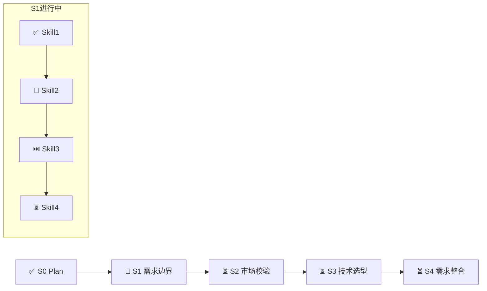

# 工作任务清单 - {PlanID}

## 基本信息

| 项目 | 内容 |
|------|------|
| **Plan 名称** | {产品名称} |
| **Plan ID** | {P000001} |
| **开始日期** | {2026-03-25} |
| **当前状态** | 执行中 / 已完成 / 已暂停 |
| **执行模式** | 常规模式 / 轻量化模式 |
| **基线版本** | v1.0.0 |
| **最后更新** | {2026-03-25 10:00:00} |

---

## 执行进度

**图例**: ✅ 已完成 | 🔄 执行中 | ⏳ 待执行 | ⏭️ 已跳过

---

## 进度概览

| 统计项 | 数值 | 进度 |
|--------|------|------|
| **总任务数** | 14 个 Skill（含 Skill15 可选） | 100% |
| **已完成** | 0 个 | 0% |
| **执行中** | 0 个 | 0% |
| **待执行** | 14 个 | 100% |
| **已评审** | 0 个 | 0% |

---

## 任务列表

### S0 阶段：Plan 制定

- [ ] **Skill0: Plan 制定**
  - **状态**: 待执行 / 执行中 / 已完成
  - **评审方式**: 必须评审 ⭐
  - **输入**: 用户原始需求
  - **输出文档**: `artifacts/{PlanID}/00-plan.md`
  - **评审状态**: 待评审 / 已通过 / 需修改
  - **评审意见**: {用户评审意见记录}
  - **开始时间**: {日期时间}
  - **完成时间**: {日期时间}
  - **备注**: 制定执行计划，确定执行模式

---

### S1 阶段：需求边界与原始采集

- [ ] **Skill1: 需求边界界定**
  - **状态**: 待执行 / 执行中 / 已完成
  - **评审方式**: AI自检
  - **输入文档**: `00-plan.md`
  - **输出文档**: `artifacts/{PlanID}/01-boundary.md`
  - **评审状态**: 待评审 / 已通过 / 需修改
  - **评审意见**: {用户评审意见记录}
  - **开始时间**: {日期时间}
  - **完成时间**: {日期时间}
  - **备注**: 明确产品目标、目标受众、核心场景

- [ ] **Skill2: 显性需求提取**
  - **状态**: 待执行 / 执行中 / 已完成
  - **评审方式**: AI自检
  - **输入文档**: `01-boundary.md`
  - **输出文档**: `artifacts/{PlanID}/02-explicit.md`
  - **评审状态**: 待评审 / 已通过 / 需修改
  - **评审意见**: {用户评审意见记录}
  - **开始时间**: {日期时间}
  - **完成时间**: {日期时间}
  - **备注**: 提取用户明确提出的功能和非功能需求

- [ ] **Skill3: 隐性需求挖掘**（常规模式执行，轻量化模式跳过）
  - **状态**: 待执行 / 执行中 / 已完成 / 已跳过
  - **评审方式**: AI自检
  - **输入文档**: `02-explicit.md`
  - **输出文档**: `artifacts/{PlanID}/03-implicit.md`
  - **评审状态**: 待评审 / 已通过 / 需修改
  - **评审意见**: {用户评审意见记录}
  - **开始时间**: {日期时间}
  - **完成时间**: {日期时间}
  - **备注**: 挖掘用户未明确表达但实际需要的隐性需求

- [ ] **Skill4: 需求验证**
  - **状态**: 待执行 / 执行中 / 已完成
  - **评审方式**: 必须评审 ⭐
  - **输入文档**: `02-explicit.md` + `03-implicit.md`
  - **输出文档**: `artifacts/{PlanID}/04-validation.md`（S1 阶段汇总）
  - **评审状态**: 待评审 / 已通过 / 需修改
  - **评审意见**: {用户评审意见记录}
  - **开始时间**: {日期时间}
  - **完成时间**: {日期时间}
  - **备注**: 验证需求完整性、一致性，生成 S1 阶段汇总

---

### S2 阶段：市场与需求价值校验（常规模式执行，轻量化模式跳过）

- [ ] **Skill9: 竞品分析**
  - **状态**: 待执行 / 执行中 / 已完成 / 已跳过
  - **评审方式**: AI自检
  - **输入文档**: `04-validation.md`
  - **输出文档**: `artifacts/{PlanID}/09-competitor.md`
  - **评审状态**: 待评审 / 已通过 / 需修改
  - **评审意见**: {用户评审意见记录}
  - **开始时间**: {日期时间}
  - **完成时间**: {日期时间}
  - **备注**: 分析竞品功能、优势、差异化

- [ ] **Skill10: 市场痛点验证**
  - **状态**: 待执行 / 执行中 / 已完成 / 已跳过
  - **评审方式**: 必须评审 ⭐
  - **输入文档**: `09-competitor.md`
  - **输出文档**: `artifacts/{PlanID}/10-market.md`（S2 阶段汇总）
  - **评审状态**: 待评审 / 已通过 / 需修改
  - **评审意见**: {用户评审意见记录}
  - **开始时间**: {日期时间}
  - **完成时间**: {日期时间}
  - **备注**: 验证市场需求真实性和商业价值

---

### S3 阶段：技术可行性与选型

- [ ] **Skill7: 需求风险识别**
  - **状态**: 待执行 / 执行中 / 已完成
  - **评审方式**: AI自检
  - **输入文档**: `04-validation.md` / `10-market.md`
  - **输出文档**: `artifacts/{PlanID}/07-risk.md`
  - **评审状态**: 待评审 / 已通过 / 需修改
  - **评审意见**: {用户评审意见记录}
  - **开始时间**: {日期时间}
  - **完成时间**: {日期时间}
  - **备注**: 识别技术、资源、时间等风险

- [ ] **Skill11: 技术可行性评估**
  - **状态**: 待执行 / 执行中 / 已完成
  - **评审方式**: AI自检
  - **输入文档**: `04-validation.md` / `10-market.md`
  - **输出文档**: `artifacts/{PlanID}/11-feasibility.md`
  - **评审状态**: 待评审 / 已通过 / 需修改
  - **评审意见**: {用户评审意见记录}
  - **开始时间**: {日期时间}
  - **完成时间**: {日期时间}
  - **备注**: 评估技术可行性和实现难度

- [ ] **Skill12: 轻量化技术选型**
  - **状态**: 待执行 / 执行中 / 已完成
  - **评审方式**: 必须评审 ⭐
  - **输入文档**: `07-risk.md` + `11-feasibility.md`
  - **输出文档**: `artifacts/{PlanID}/12-selection.md`（S3 阶段汇总）
  - **评审状态**: 待评审 / 已通过 / 需修改
  - **评审意见**: {用户评审意见记录}
  - **开始时间**: {日期时间}
  - **完成时间**: {日期时间}
  - **备注**: 选择适合的技术栈，评估成本

---

### S4 阶段：需求整合与核心提炼

- [ ] **Skill5: 需求分类梳理**
  - **状态**: 待执行 / 执行中 / 已完成
  - **评审方式**: AI自检
  - **输入文档**: `12-selection.md`
  - **输出文档**: `artifacts/{PlanID}/05-classify.md`
  - **评审状态**: 待评审 / 已通过 / 需修改
  - **评审意见**: {用户评审意见记录}
  - **开始时间**: {日期时间}
  - **完成时间**: {日期时间}
  - **备注**: 按功能模块、优先级等维度分类

- [ ] **Skill6: 需求优先级排序**
  - **状态**: 待执行 / 执行中 / 已完成
  - **评审方式**: AI自检
  - **输入文档**: `05-classify.md`
  - **输出文档**: `artifacts/{PlanID}/06-priority.md`
  - **评审状态**: 待评审 / 已通过 / 需修改
  - **评审意见**: {用户评审意见记录}
  - **开始时间**: {日期时间}
  - **完成时间**: {日期时间}
  - **备注**: 使用 MoSCoW 等方法排序

- [ ] **Skill8: 核心需求提炼**
  - **状态**: 待执行 / 执行中 / 已完成
  - **评审方式**: 必须评审 ⭐
  - **输入文档**: `06-priority.md`
  - **输出文档**: `artifacts/{PlanID}/08-core.md`（最终产物）
  - **评审状态**: 待评审 / 已通过 / 需修改
  - **评审意见**: {用户评审意见记录}
  - **开始时间**: {日期时间}
  - **完成时间**: {日期时间}
  - **备注**: 提炼 MVP 核心需求，形成最终报告

- [ ] **Skill15: 原型设计**（可选，常规模式）
  - **状态**: 待执行 / 执行中 / 已完成 / 已跳过
  - **评审方式**: 用户请求时执行
  - **输入文档**: `08-core.md`
  - **输出文档**: `artifacts/{PlanID}/15-prototype.md`
  - **评审状态**: 待评审 / 已通过 / 需修改
  - **评审意见**: {用户评审意见记录}
  - **开始时间**: {日期时间}
  - **完成时间**: {日期时间}
  - **备注**: 为核心功能创建界面原型

---

## 评审方式说明

| 评审方式 | 说明 | 适用Skill |
|----------|------|-----------|
| **必须评审** ⭐ | 必须经用户确认后才能继续 | Skill0, Skill4, Skill10, Skill12, Skill8 |
| **AI自检** | AI自动检查，无异常则继续 | 其他Skill |
| **用户请求时** | 用户主动要求时执行 | Skill15 |

---

## 评审记录

### Plan 评审（Skill0 完成后）

| 评审轮次 | 评审时间 | 评审结果 | 评审意见 | 处理状态 |
|---------|---------|---------|---------|---------|
| 第 1 轮 | {日期时间} | 通过 / 需修改 | {意见内容} | 已处理 / 处理中 |

### 阶段汇总评审

#### S1 阶段汇总评审

| 评审轮次 | 评审时间 | 评审结果 | 评审意见 | 处理状态 |
|---------|---------|---------|---------|---------|
| 第 1 轮 | {日期时间} | 通过 / 需修改 | {意见内容} | 已处理 / 处理中 |

#### S2 阶段汇总评审

| 评审轮次 | 评审时间 | 评审结果 | 评审意见 | 处理状态 |
|---------|---------|---------|---------|---------|
| 第 1 轮 | {日期时间} | 通过 / 需修改 | {意见内容} | 已处理 / 处理中 |

#### S3 阶段汇总评审

| 评审轮次 | 评审时间 | 评审结果 | 评审意见 | 处理状态 |
|---------|---------|---------|---------|---------|
| 第 1 轮 | {日期时间} | 通过 / 需修改 | {意见内容} | 已处理 / 处理中 |

#### S4 阶段汇总评审（最终报告）

| 评审轮次 | 评审时间 | 评审结果 | 评审意见 | 处理状态 |
|---------|---------|---------|---------|---------|
| 第 1 轮 | {日期时间} | 通过 / 需修改 | {意见内容} | 已处理 / 处理中 |

---

## 变更记录

| 变更日期 | 变更内容 | 变更原因 | 操作人 |
|---------|---------|---------|--------|
| {日期} | {变更描述} | {原因} | {操作人} |

---

## 备注

- **评审方式说明**:
  - 必须评审：关键节点，必须用户确认
  - AI自检：AI自动检查，提高效率
  - 用户请求：可选执行，按需触发

- **轻量化模式评审规则**:
  - 仅必须评审节点需要用户确认
  - AI自检节点自动通过
  - 评审点从19个减少到5个

---

*模板版本：2.0*
*更新内容：增加评审方式、可视化进度图*
*创建日期：2026-03-25*
*适用范围：Agent+Skill 用户需求分析系统*
